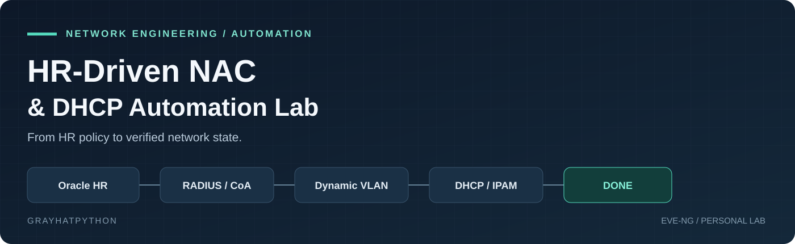
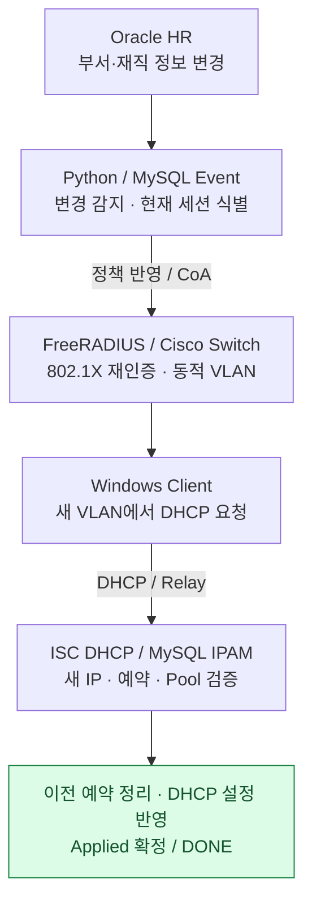

  

# HR-Driven NAC & DHCP Automation Lab

**인사정보 변경을 802.1X 재인증·VLAN 이동·DHCP 예약 정리까지 연결한 개인 네트워크 자동화 프로젝트**

Oracle의 부서 정보가 바뀌어도 이미 인증된 스위치 세션과 클라이언트 IP는 그대로 남았습니다. 이 문제를 출발점으로, **정책 변경부터 실제 네트워크 반영과 이전 자원 정리까지 상태를 추적하는 흐름**을 구현했습니다.

`Network Automation` · `802.1X / FreeRADIUS` · `Python / SQL` · `DHCP / IPAM` · `EVE-NG`

| 프로젝트 정보 | 내용 |
|---|---|
| 작성자 | [Grayhatpython](https://github.com/Grayhatpython) |
| 형태 | VMware·EVE-NG 기반 개인 학습·검증 랩 |
| 주요 작업 | 네트워크 구성, 인증/DB 연동, DHCP 정책 자동화, 부서 이동 상태 처리, 단계별 검증과 문서화 |
| 최근 완료 | `A10010`의 **VLAN21 → VLAN20** 부서 이동 정상 경로를 단계별 함수 호출로 `DONE`까지 검증 |
| 현재 방향 | 기존 인증 흐름을 유지하면서 VLAN 접근통제·보안 경계를 먼저 설계 |
| 문서 정리 기준 | 2026-09-06 |

> **읽기 전에:** 최신 랩에서는 부서 이동 정상 경로를 검증했습니다. 현재 저장소의 HR 동기화 스크립트는 변경 감지 및 Stage 갱신까지 구현된 버전입니다. 최신 랩에서 단계별로 검증한 Event 전체 흐름은 아직 하나의 Worker 실행 경로로 통합되지 않았습니다. Worker를 통한 전체 자동 실행은 다음 단계이며, 공개 파일만으로 최신 랩 전체가 재현되지는 않습니다. [공개 코드 범위](docs/15-code-coverage.md)

**빠르게 보기:** [대표 검증](docs/08-validation.md) · [설계 결정](docs/10-design-decisions.md) · [구현 상태](PROJECT_STATUS.md) · [다음 단계](docs/11-roadmap.md)

## 1. 해결하려던 문제

부서 이동을 반영하려면 계정 DB만 수정해서는 부족했습니다. RADIUS의 정책, 스위치의 현재 인증 세션, 단말의 DHCP 임대, DB의 고정 예약이 서로 다른 시점에 바뀌기 때문입니다.

| 직접 확인한 문제 | 구현한 처리 |
|---|---|
| RADIUS 그룹을 바꿔도 기존 포트는 이전 VLAN 유지 | Accounting으로 현재 세션을 식별하고 CoA 재인증 요청 |
| CoA 응답을 받아도 재인증이 실패할 수 있음 | 인증·스위치 상태를 교차 확인하고 새 DHCP 증거와 예약 상태 검증 |
| 새 VLAN으로 이동해도 이전 고정 예약이 남음 | 새 네트워크 검증 후 이전 예약만 정리하고 Pool·설정파일 동기화 |
| DB 값만 먼저 완료 처리하면 실제 적용 상태와 불일치 | Desired / Applied 분리, 최종 검증 후 Applied와 Event 완료를 함께 커밋 |

## 2. 전체 구조

위 도식은 정책 변경부터 완료까지의 처리 흐름입니다. Python은 인증·세션 정보와 DHCP/IPAM 상태를 연결합니다. 실제 인증 구간은 단말↔스위치의 EAPOL과 스위치↔FreeRADIUS의 RADIUS로 나뉩니다. [상세 연결 관계](docs/02-network-topology.md)

<strong>실제 EVE-NG 토폴로지 보기</strong>

기존 랩의 토폴로지입니다. 그림의 두 ISP 경로가 Core 이중화를 의미하지는 않습니다. 서버팜·방화벽·DMZ 확장의 구현 상태는 [네트워크 문서](docs/02-network-topology.md)에서 구분합니다.

## 3. 대표 결과: 부서 이동 한 건을 끝까지 처리

테스트 계정 `A10010`을 **VLAN21 / 172.16.21.11 → VLAN20 / 172.16.20.11**로 이동했습니다. 아래는 해당 부서 이동 시나리오를 단계별로 검증한 결과입니다.

| 확인 대상 | 변경 전 | 최종 확인 |
|---|---|---|
| RADIUS 사용자 그룹 | `VLAN_21` | `VLAN_20` |
| 스위치 인증·단말 주소 | 이전 VLAN / 이전 IP | 새 VLAN 인증 및 `172.16.20.11` 획득 |
| 이전 DHCP 예약 | `172.16.21.11` 예약 유지 | 예약 삭제, 해당 Pool `DYNAMIC` |
| 새 DHCP 예약 | 이동 전 상태 | `APPLIED` / Pool `RESERVED` 유지 |
| DHCP 설정 | 이전 static host 존재 | 이전 host 제거, 새 host 유지, 문법 검사·서비스 확인 |
| 마지막 적용 상태 | `hr_managed_user`에 VLAN21 | 최종 단계에서 VLAN20으로 갱신 |
| 이벤트 | 처리 중 | `DONE`, `completed_at` 기록, `open_username = NULL` |
| 같은 완료 함수 재실행 | — | `ALREADY_DONE`, 같은 Desired/Applied에 새 `DEPT_MOVE` 없음 |

**단계별 실행·검증을 완료한 정상 경로**입니다. 다중 사용자 부하, 장애 복구 전체, 처리 시간·성공률은 아직 측정하지 않았습니다. [검증 조건과 근거](docs/08-validation.md)

## 4. 설계에서 중요하게 다룬 부분

**목표와 완료를 분리했습니다.** `hr_employee_stage`는 HR이 원하는 상태, `hr_managed_user`는 마지막으로 적용을 완료한 상태입니다. 부서 정보가 바뀌어도 완료 기록을 먼저 덮어쓰지 않습니다.

**CoA 요청의 응답과 실제 전환 결과를 나누었습니다.** 이벤트에 세션 정보를 저장하고, DHCP 로그의 기준점(`lease_log_watermark`) 이후 수집된 새 VLAN 기록과 MAC·IP·예약·Pool을 대조합니다. 이 기준점은 수집 이력의 필터이며, 단독으로 패킷 발생 시각이나 CoA와의 인과관계를 보장하지는 않습니다.

**새 네트워크를 확인한 뒤 이전 예약을 정리했습니다.** 이전·신규 예약을 구분하고 필요한 행을 잠근 뒤 이전 예약 정확히 1건을 삭제합니다. 여기서 말하는 make-before-break는 **예약 자원 정리 순서**이며, 무중단 통신을 보장한다는 의미는 아닙니다.

**DB 변경과 외부 적용 사이에 경계를 두었습니다.** `DHCP_DB_CLEANED`와 `DHCP_CLEANED`를 분리하고, 마지막에 Applied 갱신과 Event `DONE`을 같은 트랜잭션으로 처리합니다. [상태별 조건](docs/13-event-workflow.md)

## 5. 문제 해결 사례

| 사례 | 확인 방법과 해결 방향 | 얻은 기준 |
|---|---|---|
| Ping은 되는데 802.1X가 시작되지 않음 | VMware/EVE 연결과 EAPOL 프레임 전달 구간 추적 | IP 통신과 L2 인증 프레임을 각각 검증 |
| Port Bounce 후 인증 세션만 사라짐 | CoA 응답 이후 Windows·RADIUS·스위치를 순서대로 확인, 기본 재인증 방식으로 성공 검증 | 요청 수락을 업무 완료로 기록하지 않음 |
| 이전 VLAN의 예약이 계속 남음 | 새 예약 확인 → 이전 예약 DELETE → Trigger로 Pool 복귀 → DHCP 설정 반영 | 자원 생성뿐 아니라 회수 과정까지 구현 |
| rsyslog는 실행 중인데 DB 저장 오류 발생 | MySQL 상태와 연결 경로 확인, rsyslog 재시작 후 오류 소멸 확인 | 서비스 실행 상태와 출력 모듈 성공을 구분 |

[트러블슈팅 상세](docs/09-troubleshooting.md)

## 6. 사용 기술과 담당 역할

| 영역 | 기술 | 프로젝트에서의 역할 |
|---|---|---|
| 네트워크 랩 | VMware Workstation, EVE-NG, Cisco 가상 스위치 | 단말·인증 스위치·Core·서버 구간 구성 |
| 인증·정책 | 802.1X, PEAP/EAP-MSCHAPv2, FreeRADIUS 3.x | 사용자 인증과 부서별 VLAN 반환 |
| 세션 제어 | RADIUS Accounting, CoA | 현재 접속 문맥 식별과 재인증 요청 |
| IP 관리 | ISC DHCP, MySQL, rsyslog | DHCP 이력, Scope/Pool/Reservation, 설정 생성 |
| 인사 연동 | Oracle Free Database, python-oracledb | 별도 HR 서버 조회와 부서 정책 매핑 |
| 자동화 | Python 3, SQL Trigger, systemd | 동기화·검증·상태 처리, DHCP 동기화 주기 실행 |

학습 자료의 구성과 실제 랩 환경의 차이를 비교하며 설정과 코드를 수정하고, 단계별로 장비·DB 상태를 확인했습니다. 그 과정에서 인증 성공뿐 아니라 이미 연결된 세션의 변경과 이전 IP 자원의 정리까지 다루게 됐습니다.

## 7. 현재 위치와 다음 단계

- **랩 검증 완료:** 802.1X, Dynamic VLAN, Accounting, DHCP/IPAM, HR 연동, 부서 이동 정상 경로의 단계별 처리와 `DONE` 확정.
- **현재 설계 단계:** 기존 주소 체계를 유지하는 VLAN 접근통제, 네트워크 역할 정리, 경계 보안 확장.
- **후속 구현:** Event Worker / State Dispatcher → Retry·TIMEOUT·SUPERSEDED·Offline User → HR timer와 회귀 검증.
- **장기 확장:** MAB, 퇴사자 전체 처리, 방화벽·DMZ·모니터링·Core HA. 도입 순서와 완료 조건은 [로드맵](docs/11-roadmap.md)에 정리했습니다.

## 8. 문서와 코드 탐색

| 보고 싶은 내용 | 문서 |
|---|---|
| 현재 완료 범위 | [PROJECT_STATUS](PROJECT_STATUS.md) |
| 환경·연결·인증 | [01 랩 환경](docs/01-lab-environment.md) · [02 토폴로지](docs/02-network-topology.md) · [03 인증](docs/03-8021x-freeradius.md) |
| 데이터 흐름 | [04 Accounting](docs/04-radius-accounting.md) · [05 DHCP/IPAM](docs/05-dhcp-ipam.md) · [06 HR 연동](docs/06-hr-integration.md) |
| 대표 시나리오 | [07 부서 이동](docs/07-department-move-coa.md) · [08 검증](docs/08-validation.md) |
| 구현 과정의 판단 | [09 문제 해결](docs/09-troubleshooting.md) · [10 설계 결정](docs/10-design-decisions.md) |
| 후속 방향 | [11 로드맵](docs/11-roadmap.md) · [14 보안 네트워크 설계](docs/14-network-security-plan.md) |
| 상세 상태 처리 | [13 이벤트 흐름](docs/13-event-workflow.md) |
| 소스와 재현 범위 | [scripts](scripts/README.md) · [15 공개 코드 범위](docs/15-code-coverage.md) |
| 공개 자료 관리 | [12 공개 범위](docs/12-security.md) · [SECURITY](SECURITY.md) |

프로젝트는 학습용 랩이며, 실행 파일·스키마의 제공 범위는 [코드 문서](docs/15-code-coverage.md)를 기준으로 확인해 주세요.
