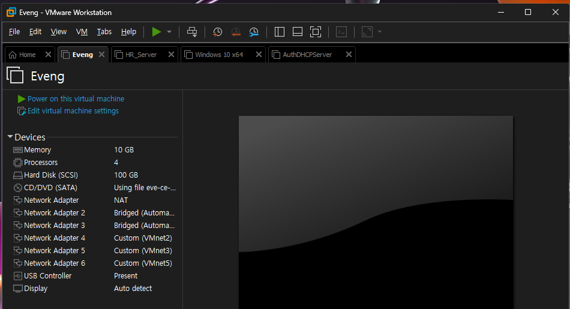
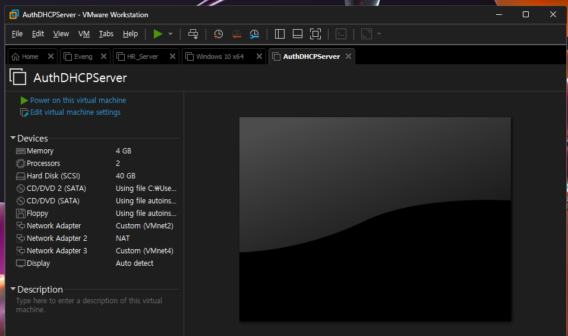
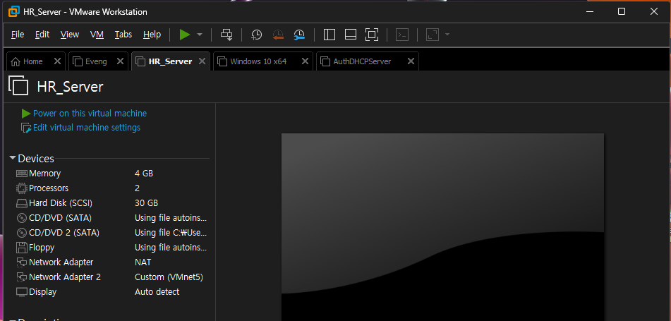
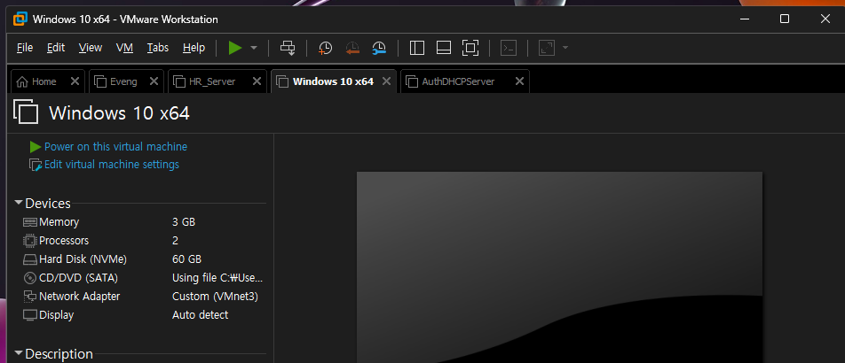

# 01. 랩 환경과 가상 머신 연결

> 아래 VM 사양은 문서화 당시의 랩 구성 기준이며, 현재 실행 중인 VM의 실시간 자원 정보를 의미하지 않습니다.

## VMware 구성

### EVE-NG



| 항목 | 값 |
|---|---|
| vCPU | 4 |
| Memory | 10 GB |
| Disk | 100 GB |
| NIC 1 | NAT |
| NIC 2 | Bridged |
| NIC 3 | Bridged |
| NIC 4 | VMnet2 |
| NIC 5 | VMnet3 |
| NIC 6 | VMnet5 |

EVE-NG VM은 VMware의 여러 VMnet을 EVE 내부 Lab으로 가져오는 **연결 허브** 역할을 합니다.

### Auth / DHCP Server



| 항목 | 값 |
|---|---|
| vCPU | 2 |
| Memory | 4 GB |
| Disk | 40 GB |
| NIC 1 | VMnet2 |
| NIC 2 | NAT |
| NIC 3 | VMnet4 |

역할:
- FreeRADIUS
- MySQL `radius`
- ISC DHCP
- rsyslog / rsyslog-mysql
- Python 자동화
- Oracle HR → RADIUS Sync
- DHCP DB → `dhcpd.conf` Sync

NIC 역할은 분리했습니다.

```text
VMnet2
→ EVE-NG / Lab 내부 서비스 연결

NAT
→ 패키지 설치 등 외부 인터넷이 필요한 경우

VMnet4
→ Host OS에서 DB/DBeaver 등 관리 접근
```

### HR Server



| 항목 | 값 |
|---|---|
| vCPU | 2 |
| Memory | 4 GB |
| Disk | 30 GB |
| NIC 1 | NAT |
| NIC 2 | VMnet5 |

역할:
- Oracle Free Database
- HR `DEPARTMENT`, `EMPLOYEE`
- `V_RADIUS_ACCOUNT`
- `RADIUS_SYNC` Read-only 계정

### Windows Client



| 항목 | 값 |
|---|---|
| vCPU | 2 |
| Memory | 3 GB |
| Disk | 60 GB |
| NIC | VMnet3 |

역할:
- 802.1X Supplicant
- PEAP / EAP-MSCHAPv2
- DHCP Client
- 사용자 VLAN 변경 검증

## VMnet 연결 관계

```text
Windows Client
  VMnet3
    │
    ▼
EVE-NG NIC 5
    │
    ▼
EVE 내부 Access Switch

Auth/DHCP Server
  VMnet2
    │
    ▼
EVE-NG NIC 4
    │
    ▼
EVE 내부 Server-side Switch

HR Server
  VMnet5
    │
    ▼
EVE-NG NIC 6
    │
    ▼
EVE 내부 Server-side Switch
```

VMware의 VMnet은 물리 케이블 대신 **Host 안에서 VM과 EVE-NG를 연결하는 L2 Segment**로 사용했습니다.

> 공개용 이미지에서는 로컬 Windows 사용자 경로가 표시되는 하단 VM 상세정보를 제외했습니다.
