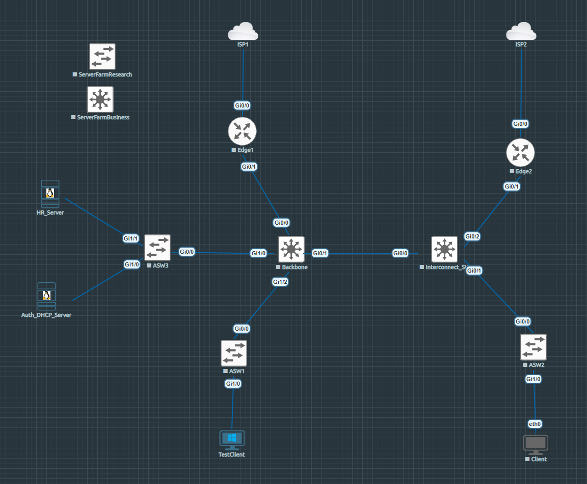

# 02. 네트워크 토폴로지와 연결 관계

[README](../README.md) · [보안 확장 목표](14-network-security-plan.md)

## 현재 랩

현재 랩의 주요 연결 관계를 기준으로 토폴로지를 정리했습니다. 핵심 인증 경로는 TestClient → ASW1 → Backbone → ASW3 → Auth_DHCP_Server입니다.

| 구성요소 | 현재 역할 | 상태 해석 |
|---|---|---|
| Backbone | 사용자 SVI, VLAN 간 라우팅, DHCP Relay의 중심 | 핵심 Core 단일 구성 |
| ASW1 | Windows 단말의 802.1X Authenticator | 대표 부서 이동 검증 대상 |
| ASW3 | Auth/DHCP 및 HR 서버 연결 | 인프라 서비스 경로 |
| Interconnect_SW | Backbone·Edge2·ASW2 연결 | 여러 역할을 정리할 후속 대상 |
| Edge1 / Edge2 | 각 ISP 방향 연결 | 이 그림만으로 failover 완료를 주장하지 않음 |
| ASW2 / Client | 추가 접속 구간 | 대표 `DONE` 시나리오와 별도 |
| Research / Business Server Farm | 확장을 위한 노드·VLAN | 현재 그림에서 연결되지 않은 확장 영역 |

## 주소와 VLAN

Auth/DHCP 서버는 `172.16.10.10`, Oracle HR 서버는 `172.16.10.11`, 해당 Backbone SVI는 `172.16.10.1/24`입니다. 최신 첨부 텍스트에서 다음 VLAN과 SVI를 확인했습니다.

| VLAN | 용도 | Backbone SVI |
|---:|---|---|
| 10 | 인증·보안 서비스 및 보안장비 관리 | `172.16.10.1/24` |
| 11 | 네트워크 장비 관리 | `172.16.11.1/24` |
| 12 | 연구 서버팜 | `172.16.12.1/24` |
| 13 | 행정·지원 서버팜 | `172.16.13.1/24` |
| 20 | 정보보안 부서 | `172.16.20.1/24` |
| 21 | 연구 부서 | `172.16.21.1/24` |
| 22 | 행정·지원 부서 | `172.16.22.1/24` |
| 23 | 유지보수·협력업체 | `172.16.23.1/24` |
| 24 | 방문자 | `172.16.24.1/24` |
| 80 | 기숙사 | 제공된 Backbone SVI 목록에는 없음 |
| 98 | 인증 실패용 | `172.16.98.1/24` |
| 99 | 인증 환경 구성용 | `172.16.99.1/24` |
| 200 | Backbone–Interconnect 전송망 | 현재 확인된 Backbone SVI 구성에는 없음 |

VLAN이 정의돼 있다는 사실과 그 VLAN의 ACL·단말 수용 정책을 검증했다는 사실은 구분합니다. VLAN10에는 관리와 실제 서비스가 함께 있으므로 향후 역할 분리를 검토하되, 현재 `.10`·`.11` 주소는 네트워크 확장 초기에 유지하는 계획입니다.

## 프로토콜별 실제 경로

| 흐름 | 출발 → 도착 | 프로토콜·목적 |
|---|---|---|
| 단말 인증 | Windows ↔ ASW1 | EAPOL, IP 라우팅과 별개인 L2 인증 구간 |
| 인증 요청 | ASW → Auth 서버 | UDP 1812 / RADIUS |
| 세션 기록 | ASW → Auth 서버 | UDP 1813 / Accounting |
| 재인증 제어 | Auth 서버 → ASW | UDP 3799 / 랩의 CoA 수신 포트 |
| DHCP 초기 요청 | 단말 → VLAN SVI → DHCP 서버 | 단말 UDP 68→67, Relay가 서버로 전달 |
| HR 조회 | Auth 서버 → HR 서버 | TCP 1521 / Oracle |
| DB 관리 | 관리 단말 → Auth 서버 | TCP 3306 / 허용된 관리 연결 |

응답 경로까지 통과해야 각 기능이 성립합니다. EAPOL을 FreeRADIUS 서버까지 라우팅하는 구조로 해석하지 않습니다.

## 가상화 연결

VMware의 VMnet은 VM 사이의 L2 연결을 만들고, EVE-NG의 pnet/bridge가 이를 가상 스위치 인터페이스와 연결합니다. Host 관리망, 랩 서비스망, 패키지 설치용 NAT의 목적을 분리했습니다. VM 사양과 연결 스냅샷은 [랩 환경](01-lab-environment.md)에 있습니다.

## 확장 시 유지할 경계

현재 토폴로지와 [방화벽·DMZ·Core HA 목표](14-network-security-plan.md)는 별개입니다. 네트워크 변경 전에 인증·Accounting·CoA·DHCP·Oracle의 허용 경로를 먼저 정리하고, 변경 후 VLAN21 → VLAN20 정상 경로를 다시 확인할 계획입니다.
