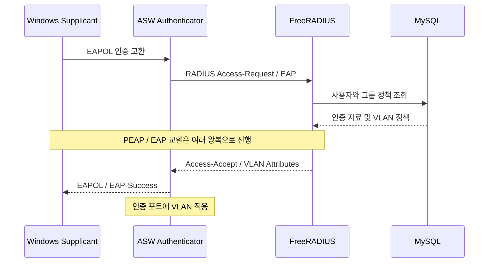

# 03. 802.1X와 FreeRADIUS

[README](../README.md) · [Accounting](04-radius-accounting.md)

## 구성 목적

Windows가 유선 802.1X로 인증하고, FreeRADIUS가 부서에 맞는 VLAN 정책을 스위치에 반환하도록 구성했습니다. 현재 랩 인증 방식은 PEAP / EAP-MSCHAPv2입니다.



## 사용자와 VLAN 연결

| 테이블 | 역할 |
|---|---|
| `radcheck` | 사용자 인증 Attribute |
| `radusergroup` | 사용자와 RADIUS 그룹 연결 |
| `radgroupreply` | 그룹의 VLAN 응답 Attribute |

예를 들어 `A10010 → VLAN_20` 그룹에 다음 응답을 연결합니다.

```text
Tunnel-Type = VLAN
Tunnel-Medium-Type = IEEE-802
Tunnel-Private-Group-Id = 20
```

FreeRADIUS 3.x의 SQL 모듈과 `inner-tunnel` 인증 경로를 확인했습니다. FreeRADIUS 3.x의 실제 디렉터리 구조를 기준으로 mods-available/sql, mods-enabled/sql, sites-enabled/default, sites-enabled/inner-tunnel의 역할을 확인하고 구성했습니다.

## 검증한 내용

- Windows와 ASW 사이 EAPOL 교환.
- FreeRADIUS 사용자 조회와 Access-Accept.
- 스위치의 Authorized 상태와 반환 VLAN.
- 부서 이동 후 저장된 자격증명을 사용한 재인증과 신규 VLAN 주소 획득.

클라이언트가 자격증명을 다시 묻지 않았다는 사실을 비밀번호 해시의 평문 전송으로 해석하지 않습니다. 인증 서버로부터 받은 RADIUS 응답과 단말의 EAPOL 교환도 구분합니다.

## 랩 범위

Windows 인증서 신뢰 설정과 FreeRADIUS 인증서의 현재 실물은 이 저장소에 포함하지 않았습니다. MAB와 인증 실패/온보딩 VLAN의 세부 접근통제는 별도 확장 과제입니다. 전체 스위치 설정을 그대로 배포하는 문서가 아니라, 구현한 인증 관계를 설명하는 문서입니다.
