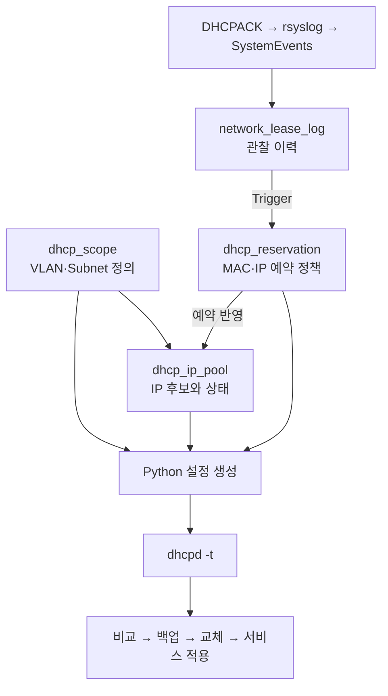

# 05. DHCP / IPAM 자동화

[README](../README.md) · [부서 이동](07-department-move-coa.md)

## 목적과 흐름

최초 DHCP 할당을 관찰해 같은 Scope 안에서 MAC–IP 예약을 만들고, DB 정책으로 DHCP 설정을 생성합니다. 단말이 다른 VLAN으로 이동하면 새 Scope의 IP를 사용하므로 모든 VLAN에서 같은 IP를 유지하는 설계는 아닙니다.

화살표는 처리·참조 관계입니다. 실제 FK의 유무는 공개 SQL 및 최신 랩 DDL을 따로 확인해야 합니다.

## 데이터의 책임

| 테이블 | 책임 | 구분해야 할 점 |
|---|---|---|
| `network_lease_log` | MAC, IP, VLAN, 원문·시각 등 관찰 기록 | 과거 이력이 현재 정책을 대신하지 않음 |
| `dhcp_scope` | Subnet, Gateway, DNS, Lease, 활성 상태 | VLAN별 DHCP 설정 단위 |
| `dhcp_ip_pool` | `DYNAMIC` / `RESERVED` / `EXCLUDED` | 주소를 동적 범위에 포함할지 관리 |
| `dhcp_reservation` | Scope별 MAC–IP 예약, 적용 상태 | 현재 유효한 고정 정책 |

`(scope_id, client_mac)`과 `(scope_id, reserved_ip)`를 유일하게 관리해 동일 Scope의 중복 예약을 제한합니다. 서로 다른 Scope의 OLD/NEW 예약이 이동 중 공존하는 것은 허용합니다.

## 설정 생성과 적용

[공개 스크립트](../scripts/sync-dhcp-from-db.py)는 활성 Scope와 Reservation을 읽고 `DYNAMIC` 주소를 연속 범위로 합쳐 후보 설정을 만듭니다. 예약 주소를 동적 Range에서 제외하고, 후보 파일을 `dhcpd -t`로 검사합니다.

변경이 있으면 기존 파일을 백업한 뒤 교체하고 서비스를 재시작합니다. 재시작 실패 시 백업 복원을 시도하는 경로도 포함합니다. 다만 복구 성공 전체가 자동 보장되는 것은 아니며, 복구 후 서비스·설정 재검증은 별도 확인 대상입니다.

DHCP 동기화에는 systemd oneshot 서비스와 timer를 구성했습니다. HR Event Worker용 timer는 아직 별도 후속 과제입니다.

## 이전 예약의 회수

새 네트워크 검증 후 이전 예약 정확히 1건을 삭제합니다. 삭제 Trigger는 이전 IP를 `RESERVED → DYNAMIC`으로 바꾸고, Python 설정 반영으로 이전 static host를 제거합니다. 최신 랩에서는 이 과정을 `DHCP_DB_CLEANED → DHCP_CLEANED`로 구분했습니다.

여기서 Pool 복귀는 **할당 정책의 회수**입니다. Windows에 남아 있는 임대 주소를 즉시 삭제하거나 DHCP lease 파일을 강제로 비우는 의미가 아닙니다. DHCP의 임대·갱신 절차는 [RFC 2131](https://www.rfc-editor.org/rfc/rfc2131)을 따르며, 재할당 충돌·기존 임대 정합성은 확장 검증 대상입니다.

## 공개 스냅샷의 한계

전체 DHCPACK 수집·최초 예약 Trigger와 최신 Event 통합 함수는 미포함입니다. 생성 스크립트의 동시 실행·DB 스냅샷 일관성·APPLIED 갱신 범위에 대해서도 [공개 코드 범위](15-code-coverage.md)에 점검할 항목을 남겼습니다.
