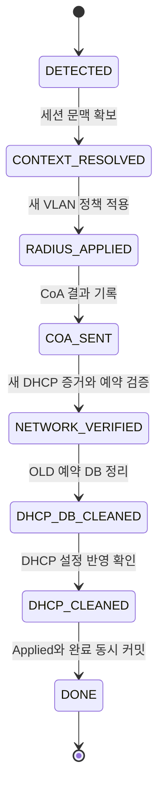

# 13. Event Workflow와 완료의 의미

[README](../README.md) · [검증](08-validation.md) · [공개 코드 범위](15-code-coverage.md)

이 문서는 최신 랩에서 단계별로 검증한 `DEPT_MOVE` 정상 경로를 설명합니다. 자동 Dispatcher 구현이나 최신 실행 코드 배포를 의미하지 않습니다.

## 상태 전이

`event_type = DEPT_MOVE`는 작업의 종류이며 그대로 유지됩니다. 진행 위치는 `state`가 나타냅니다.

## 상태별 경계

| State | 기록하는 사실 | 다음 상태 전에 필요한 확인 |
|---|---|---|
| `DETECTED` | OLD/NEW가 다른 부서 이동 작업이 생성됨 | 현재 세션 후보와 대상 사용자 식별 |
| `CONTEXT_RESOLVED` | 세션·NAS·Port·MAC 문맥 저장 | NEW 매핑, 활성 Scope, RADIUS VLAN Attribute, 기존 그룹 |
| `RADIUS_APPLIED` | RADIUS 그룹을 NEW 정책으로 변경 | CoA 대상 세션 재확인과 Action 준비 |
| `COA_SENT` | 정상 경로에서 CoA 전송·응답을 기록 | 새 VLAN의 DHCP 증거 및 NEW 예약/Pool |
| `NETWORK_VERIFIED` | 새 네트워크 증거와 NEW 예약 상태 검증 | OLD/NEW 구분, 정리 대상 Snapshot·행 잠금 |
| `DHCP_DB_CLEANED` | OLD 예약 삭제·Pool 복귀를 DB에 커밋 | 설정 생성·문법·서비스·OLD/NEW host 확인 |
| `DHCP_CLEANED` | DHCP 설정 반영까지 확인 | RADIUS·DHCP 최종 정합성과 Applied OLD 재확인 |
| `DONE` | Applied 갱신과 Event 완료를 함께 커밋 | 재실행은 `ALREADY_DONE` |

`NETWORK_VERIFIED`는 이 랩의 MAC·VLAN·DHCP·IPAM 조건에 대한 이름입니다. 단말의 모든 서비스 접근이나 보안 정책 전체의 검증을 의미하지 않습니다.

## 세 종류의 데이터

| 데이터 | 책임 |
|---|---|
| `hr_network_event` | 변경의 종류, OLD/NEW, 현재 State, 대상 문맥, 정리 Snapshot |
| `hr_network_action_log` | CoA 같은 외부 요청의 시도·대상·결과·로그 기준점 |
| `hr_managed_user` | 마지막으로 성공을 확정한 적용 상태 |

위 테이블 관계는 현재 Event Workflow 설계에서 사용하는 데이터 모델입니다. 현재 Repository의 SQL 파일에는 Event·Action Log DDL이 없습니다.

## 트랜잭션 경계

**RADIUS 적용:** Event와 현재 정책을 검증하고 정책 변경 및 State 갱신을 묶습니다. 스위치의 실시간 세션은 별도 CoA 단계에서 처리합니다.

**DHCP DB 정리:** OLD Reservation/Pool과 NEW Reservation을 보호하고 OLD 삭제 및 Event `DHCP_DB_CLEANED`를 커밋합니다. 파일 생성과 서비스 적용은 그 이후 별도 단계입니다.

**최종 확정:** RADIUS·DHCP 정합성을 다시 확인하고, Applied가 Event OLD와 일치하는지 잠금 상태에서 검사한 뒤 NEW 갱신과 `DONE`을 함께 커밋합니다.

## 재실행에서 확인한 것과 남은 것

문맥 추출·정책 반영의 중복 변경 방지와 최종 완료 함수의 `ALREADY_DONE`을 확인했습니다. `open_username`의 해제와 동일 Desired/Applied에서 새 이동 Event가 생성되지 않는 조건도 확인했습니다.

동시 Worker, 프로세스 중단, CoA ACK 유실, 네트워크 적용과 DB 기록 사이의 실패를 포함한 전체 멱등성과 자동 복구는 아직 별도 과제입니다. 상태를 기록하는 구조가 있다는 이유만으로 이 장애 경로들이 자동 해결됐다고 표현하지 않습니다.
