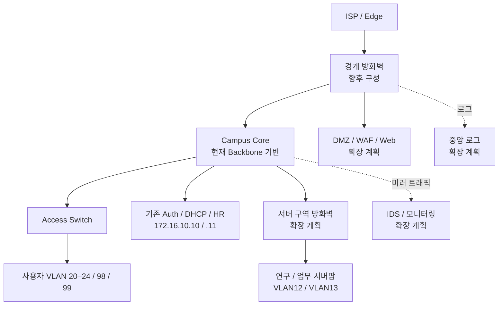

# 14. 보안 네트워크 확장 설계

[README](../README.md) · [현재 토폴로지](02-network-topology.md) · [로드맵](11-roadmap.md)

**상태: 설계·계획.** 상태: 설계·계획. 현재 NAC 환경을 기반으로 향후 적용할 네트워크 접근통제 및 경계 보안 방향을 정리했습니다. ACL·방화벽·DMZ·WAF·IDS·Core HA는 아직 구축 완료 상태가 아닙니다.

## 확장의 목적

802.1X가 사용자를 어떤 VLAN으로 보낼지 결정했다면, 다음 과제는 그 VLAN에서 접근할 수 있는 자원을 정의하는 것입니다. 기존 NAC 정상 경로를 보존하면서 인증 정책을 실제 접근통제로 연결합니다.

## 목표 구조

HA는 이 그림에 배치됐다는 이유만으로 성립하지 않습니다. Core 이중화는 Relay 매핑과 장애 전환 시험을 포함하는 별도 단계로 둡니다.

## 먼저 보존할 통신

| 출발 | 도착 | 필요한 흐름 | 보존 목적 |
|---|---|---|---|
| 인증 스위치 관리 IP | `172.16.10.10` | UDP 1812 및 응답 | 인증 |
| 인증 스위치 관리 IP | `172.16.10.10` | UDP 1813 및 응답 | Accounting |
| `172.16.10.10` | 인증 스위치 | UDP 3799 및 응답 | 랩 CoA |
| 사용자 VLAN의 Relay | `172.16.10.10` | DHCP UDP 67 및 반환 경로 | IP 할당 |
| 단말 | Relay/서버 경로 | DHCP 초기·갱신·응답 | 클라이언트 주소 설정 |
| `172.16.10.10` | `172.16.10.11` | TCP 1521 및 응답 | HR 조회 |
| 허용된 관리 단말 | 관리 대상 | 지정 SSH/DB/관리 서비스 | 운영 접근 |

이 표는 ACL 완성본이 아닙니다. 단말 측 DHCP, Relay–서버 간 흐름, 기존 임대의 갱신 경로와 응답 방향을 적용 위치에 맞게 구체화해야 합니다.

## 사용자 영역의 정책 초안

| 출발 영역 | 허용 방향 | 제한 방향 |
|---|---|---|
| VLAN20 정보보안 | 지정 업무 서비스·승인된 관리 경유지 | 부서 VLAN 전체에 무제한 관리 권한을 부여하지 않는 방향 |
| VLAN21 연구 | 연구 서버의 필요한 서비스 | 업무 서버·다른 사용자·관리망 직접 접근 |
| VLAN22 행정·지원 | 업무 서버의 필요한 서비스 | 연구 서버·다른 사용자·관리망 직접 접근 |
| VLAN23 협력업체 | 지정 Jump Host와 승인 서비스 | 서버팜·관리망 전체 직접 접근 |
| VLAN24 방문자 / VLAN80 기숙사 | 필수 인프라와 인터넷 | 내부 업무·관리 영역 |
| VLAN98 인증 실패 | 필요한 복구 서비스 | 일반 업무 접근 |
| VLAN99 인증 환경 구성 | 필요한 DHCP·DNS·NTP·인증 설정 서비스 | 일반 업무 접근 |

‘필요한 서비스’의 실제 주소·포트·사유는 Access Matrix 확정 단계에서 정의합니다. VLAN20 → 모든 관리 장비 허용처럼 넓은 정책을 완료된 설계로 간주하지 않습니다.

## 구현 시 확인할 설계 경계

- **Core ACL과 방화벽:** 사용자 SVI에서 출발 트래픽을 관리하는 원칙을 검토하되, 상태 추적 방화벽과 정적 ACL의 역할을 구분합니다.
- **같은 VLAN 통신:** SVI를 지나지 않는 같은 L2 구간 통신은 별도 통제 대상입니다.
- **DMZ:** VLAN90 / `172.16.90.0/24`는 제안된 주소이며 현재 구현 주소가 아닙니다. 내부 접근은 서비스 단위로 정의합니다.
- **서버 구역:** VLAN12/13 Gateway를 방화벽 쪽으로 옮긴다면 기존 Core SVI를 통한 우회 경로와 중복 Gateway를 함께 제거·검증해야 합니다.
- **Core HA:** VIP와 실제 Relay 주소가 달라질 수 있으므로, 현재 DHCP 로그 파서가 어떤 방식으로 VLAN을 판별하는지 최신 코드부터 확인합니다. 다중 Relay→Scope 매핑은 후속 설계입니다.
- **NAT:** 기존 Edge 설정의 실제 NAT 위치를 확인한 뒤 경계 방화벽 도입 시 역할을 정합니다.
- **관측 장비:** IDS 미러 트래픽, 방화벽 로그, 인증 로그를 분리해서 연결합니다. 모든 보안 기능을 사용자 패킷 경로에 직렬로 넣는 구조로 만들지 않습니다.

## 회귀 완료 조건

한 구간씩 변경하고 허용·차단 시험과 인증·DHCP 확인을 수행합니다. 최종적으로 기존 A10010의 VLAN21 → VLAN20 시나리오가 `DONE`까지 재현되고, OLD 예약·설정 정리와 NEW 상태 유지가 확인돼야 자동화 개발로 복귀합니다.
