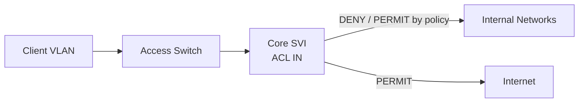
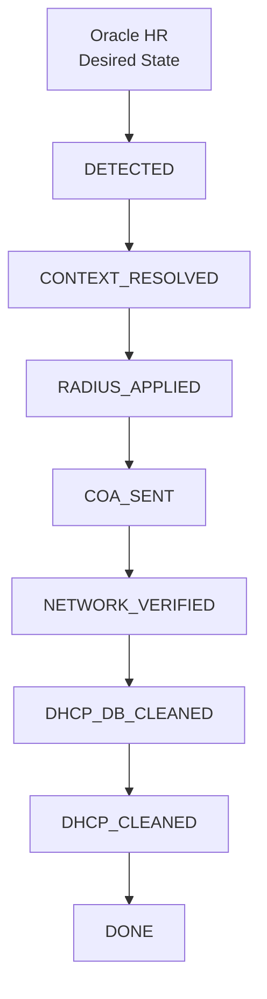
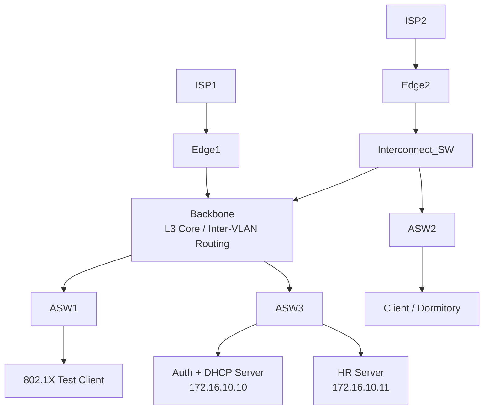
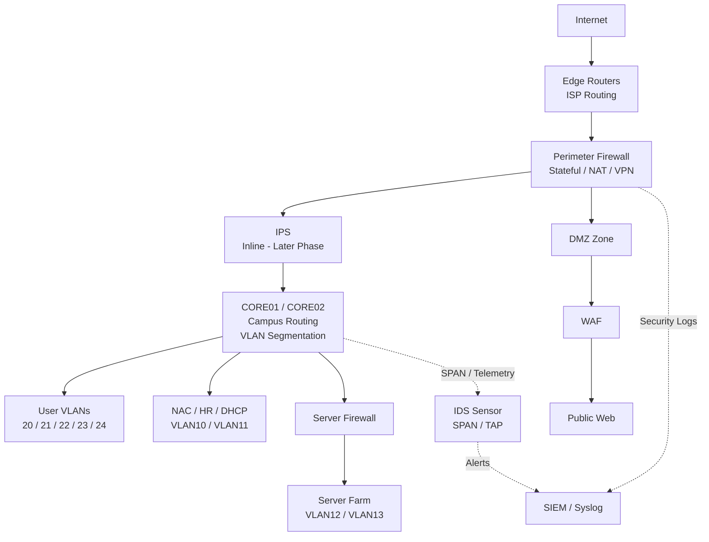
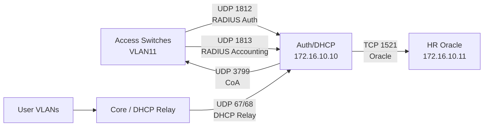
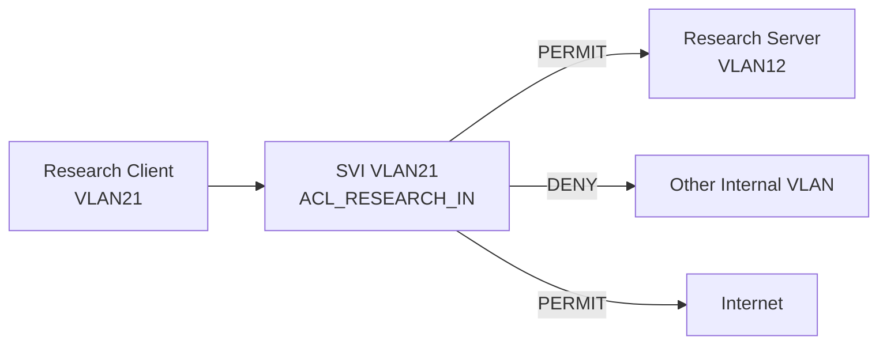

# 네트워크 보안 아키텍처 확장 및 VLAN 접근통제 구축 기록

> **현재 기준:** HR-Driven 802.1X / Dynamic VLAN / CoA / DHCP-IPAM 자동화의 `DEPT_MOVE` 정상 경로가 `DONE`까지 검증된 상태에서 네트워크 보안 인프라 확장 작업을 진행한다.

---

# 1 현재 상태

작업 전 장비와 서비스 상태를 기록한다.

| 항목 | 확인 내용 |
|---|---|
| 대상 장비 | Backbone / Core |
| 대상 VLAN | 작업 단계별 기록 |
| Gateway | 작업 단계별 기록 |
| Routing | 변경 전 정상 여부 |
| DHCP | 정상 여부 |
| DNS | 정상 여부 |
| 802.1X | 정상 여부 |
| RADIUS Accounting | 정상 여부 |
| CoA | 정상 여부 |
| Event Workflow | 기존 `DONE` 상태 유지 여부 |

작업 전에 항상 **정상 상태 Baseline**을 확보한다.

# 2 토폴로지 / 흐름도

GitHub에서 바로 볼 수 있도록 가능하면 **Mermaid Diagram**을 사용한다.



---

# 3. 현재 프로젝트 Baseline

현재 네트워크 보안 확장 작업을 시작하기 전 기준 상태다.

## 3.1 NAC / 자동화 상태

현재 사용자 변경 자동화의 정상 경로는 다음 단계까지 검증되었다.



검증된 대표 시나리오:

```text
A10010

OLD
VLAN21
172.16.21.11

NEW
VLAN20
172.16.20.11
```

이 정상 경로는 네트워크 보안 인프라 변경 기간 동안 **기준 Regression Test**로 사용한다.

---

# 4. 현재 VLAN 설계

| VLAN | 역할 | 네트워크 | 현재 방향 |
|---:|---|---|---|
| 10 | Security / NAC Service | 172.16.10.0/24 | 유지 |
| 11 | Network Management | 172.16.11.0/24 | 유지 |
| 12 | Research Server Farm | 172.16.12.0/24 | 서버 보안 영역으로 확장 예정 |
| 13 | Business Server Farm | 172.16.13.0/24 | 서버 보안 영역으로 확장 예정 |
| 20 | Security Department | 172.16.20.0/24 | ACL 적용 예정 |
| 21 | Research Department | 172.16.21.0/24 | ACL 적용 예정 |
| 22 | Business Department | 172.16.22.0/24 | ACL 적용 예정 |
| 23 | Partner / Maintenance | 172.16.23.0/24 | 강한 제한 정책 예정 |
| 24 | Guest | 172.16.24.0/24 | **첫 ACL 적용 대상** |
| 80 | Dormitory | 172.16.80.0/24 | Internet 중심 정책 예정 |
| 98 | 802.1X Authentication Fail | 172.16.98.0/24 | Remediation 제한망 예정 |
| 99 | 802.1X Authentication Start | 172.16.99.0/24 | Onboarding 제한망 예정 |

---

# 5. 현재 Logical Topology



현재 Backbone은 다음 역할을 동시에 수행한다.

```text
Inter-VLAN Routing
Default Gateway
DHCP Relay
Internal Routing
Edge 방향 Routing
```

장기적으로 역할을 분리하지만 현재 NAC 안정성을 유지하기 위해 단계적으로 변경한다.

---

# 6. 목표 보안 아키텍처

최종 목표는 단일 ACL 실습이 아니라 **계층형 보안 네트워크**다.



각 보안 계층의 책임을 분리한다.

| 계층 | 주요 기능 |
|---|---|
| Access Layer | 802.1X, Port Security, DHCP Snooping, DAI |
| NAC | Identity 기반 Dynamic VLAN, CoA |
| Core ACL | VLAN 간 큰 범위의 Segmentation |
| Perimeter Firewall | North-South Stateful Policy, NAT, VPN |
| Server Firewall | User ↔ Server East-West 정책 |
| WAF | HTTP/HTTPS Application 보호 |
| IDS/IPS | Threat Detection / Prevention |
| SIEM | 중앙 로그 / 이벤트 분석 |

---

# 7. 네트워크 보안 확장 전체 Roadmap

현재 802.1X 플랫폼 개발은 잠시 Freeze하고 아래 순서로 진행한다.

```mermaid
flowchart LR
    P0["Phase 0\nBaseline"]
    P1["Phase 1\nNetwork Role 정리"]
    P2["Phase 2\nVLAN Security Matrix"]
    P3["Phase 3\nCore ACL"]
    P4["Phase 4\nPerimeter Firewall"]
    P5["Phase 5\nDMZ + WAF"]
    P6["Phase 6\nServer Firewall"]
    P7["Phase 7\nIDS / SIEM"]
    P8["Phase 8\nCore HA"]
    REG["NAC Regression Test"]
    WORKER["Event Worker /\nState Dispatcher"]

    P0 --> P1
    P1 --> P2
    P2 --> P3
    P3 --> P4
    P4 --> P5
    P5 --> P6
    P6 --> P7
    P7 --> P8
    P8 --> REG
    REG --> WORKER
```



---

# 8. 변경 금지 영역

네트워크 보안 확장 중 아래 항목은 가능한 한 변경하지 않는다.

```text
Auth / DHCP Server      172.16.10.10
HR Server               172.16.10.11
ASW Management          VLAN11
User VLAN20~24          기존 Subnet 유지
Auth Fail VLAN98        기존 Subnet 유지
Auth Start VLAN99       기존 Subnet 유지
Client Gateway          172.16.X.1 유지
```

또한 다음 애플리케이션 로직도 Freeze한다.

```text
FreeRADIUS Schema
hr_network_event State Machine
CoA 처리 코드
DHCP Reservation Logic
network_lease_log Watermark Logic
```

네트워크 변경 후 Regression Test가 성공하면 다시 자동화 개발을 재개한다.

---

# 9. NAC Critical Flow

ACL / Firewall 정책을 적용하기 전에 반드시 보호해야 하는 통신이다.



이 흐름은 이후 ACL 정책의 예외 규칙에서 반드시 고려한다.

---

# 10. VLAN Security Policy 기본 방향

이번 프로젝트에서는 사용자 VLAN ACL을 원칙적으로 **Source VLAN SVI의 IN 방향**에서 통제한다.



장점:

```text
정책을 Source 기준으로 이해하기 쉽다.
각 부서 VLAN의 보안 요구사항을 한 위치에서 관리할 수 있다.
IN/OUT ACL이 혼합되어 운영자가 혼동하는 것을 줄인다.
```

단, 같은 VLAN 안의 Host-to-Host 트래픽은 SVI를 지나지 않으므로 Core ACL만으로 통제되지 않는다.

---

# 11. 전체 VLAN 접근정책 초안

아래 표는 실제 ACL 작성 전 정책 초안이다. 다음 단계에서 서비스 Port까지 세분화한다.

| Source | Security Service | Network Mgmt | Research Server | Business Server | Other Users | Internet |
|---|---:|---:|---:|---:|---:|---:|
| VLAN20 Security | 제한 허용 | 제한 허용 | 허용 | 허용 | 기본 차단 | 허용 |
| VLAN21 Research | 필요 서비스만 | 차단 | 허용 | 차단 | 차단 | 허용 |
| VLAN22 Business | 필요 서비스만 | 차단 | 차단 | 허용 | 차단 | 허용 |
| VLAN23 Partner | 지정 Jump Host만 | 직접 차단 | 지정 서비스만 | 지정 서비스만 | 차단 | 필요 시 허용 |
| VLAN24 Guest | DHCP/DNS 등 최소 | 차단 | 차단 | 차단 | 차단 | 허용 |
| VLAN80 Dormitory | DHCP/DNS 등 최소 | 차단 | 차단 | 차단 | 차단 | 허용 |
| VLAN98 AuthFail | Remediation 최소 | 차단 | 차단 | 차단 | 차단 | 기본 차단 |
| VLAN99 AuthStart | Onboarding 최소 | 차단 | 차단 | 차단 | 차단 | 필요 최소 |

---

# 12. ACL 적용 우선순위

한 번에 모든 VLAN을 적용하지 않는다.

```text
1. VLAN24 Guest
2. VLAN80 Dormitory
3. VLAN98 AuthFail
4. VLAN99 AuthStart
5. VLAN23 Partner
6. VLAN21 Research
7. VLAN22 Business
8. VLAN20 Security
```

위험도가 낮고 정책이 단순한 VLAN부터 시작한다.

---

# 13. 첫 번째 실제 구축 단계

## Phase 3-1 — Guest VLAN24 접근통제

📁 [Guest VLAN24 접근통제](/phase-03-01-guest-acl.md)
