# Phase 3-1. Guest VLAN24 접근통제 구축

> **프로젝트:** Network Infrastructure & Access Control Portfolio  
> **상위 문서:** `21-network-security-architecture-and-acl-implementation.md`  
> **단계:** Phase 3-1  
> **상태:** ✅ 완료  
> **대상 VLAN:** VLAN24 Guest  
> **대상 네트워크:** `172.16.24.0/24`  
> **Default Gateway:** `172.16.24.1`  
> **적용 장비:** Backbone/Core L3 Switch  
> **적용 위치:** `interface Vlan24`  
> **ACL 방향:** `in`  
> **ACL 이름:** `ACL_GUEST_IN`

---

# 1. 목표

Guest VLAN24 사용자는 인터넷 접근은 가능해야 하지만 내부 사설 네트워크에는 접근할 수 없어야 한다.

이번 단계의 목표는 다음과 같다.

```text
Guest VLAN24
172.16.24.0/24
        │
        ├── DHCP                  PERMIT
        ├── Default Gateway ICMP PERMIT
        │
        ├── 10.0.0.0/8           DENY
        ├── 172.16.0.0/12        DENY
        ├── 192.168.0.0/16       DENY
        │
        └── Public Internet      PERMIT
```

단순히 내부망 Ping만 막는 것이 아니라, Guest VLAN을 **Internet-Only 성격의 제한망**으로 만드는 것이 목적이다.

이 단계에서는 802.1X, FreeRADIUS, Dynamic VLAN, DHCP/IPAM 자동화 로직은 변경하지 않는다.

---

# 2. 선행 조건

Guest Client는 이번 ACL 작업 전에 이미 아래 정상 상태를 확보했다.

```text
User        A10014
MAC         00:0c:29:47:ff:ff
Switch      ASW1
Port        GigabitEthernet1/1
VLAN        24
IPv4        172.16.24.11/24
Gateway     172.16.24.1
```

802.1X 인증 과정 또한 정상이다.

```text
Guest Windows
      │
      │ EAPOL
      ▼
ASW1 Gi1/1
      │
      │ RADIUS
      ▼
FreeRADIUS
      │
      ▼
A10014 인증 성공
      │
      ▼
Dynamic VLAN24
      │
      ▼
DHCP
172.16.24.11
```

---

# 3. 사전 트러블슈팅 — Guest 802.1X 인증 실패

ACL 작업 전에 Guest Client를 새로 추가하는 과정에서 802.1X 인증 실패 문제가 발생했다.

## 3.1 증상

Guest Client가 인증을 시도했지만 정상적인 802.1X 세션이 형성되지 않았고 APIPA 주소가 나타났다.

Cisco debug에서는 동일한 Guest MAC이 의도한 `Gi1/1`뿐 아니라 다른 포트에서도 관찰되었다.

또한 Wireshark에서는 복수 Authenticator MAC의 EAP frame이 동시에 보였다.

## 3.2 원인

Internal Client와 Guest Client가 동일한 VMware `VMnet`을 공유하고 있었기 때문에 외부 가상 네트워크에서 Access Port 간 L2 분리가 무너졌다.

```text
                  동일 VMware VMnet
             ┌─────────┼─────────┐
             │         │         │
        Internal     Guest      EVE NICs
                                  │
                         ┌────────┴────────┐
                         │                 │
                     ASW1 Gi1/0        ASW1 Gi1/1
```

Guest가 보낸 EAPOL이 하나의 Authenticator Port에만 도달하지 않고 복수 경로에 노출되면서 Port-based 802.1X 상태머신이 정상적으로 동작하지 못했다.

## 3.3 해결

Guest 전용 VMware 네트워크를 새로 분리했다.

```text
Internal Client
     │
   VMnet3
     │
 EVE pnet4
     │
 ASW1 Gi1/0


Guest Client
     │
   VMnet6
     │
 EVE pnet6
     │
 ASW1 Gi1/1
```

그리고 Guest 전용 EVE Linux Bridge에서 EAPOL forwarding을 허용했다.

```bash
echo 8 > /sys/class/net/pnet6/bridge/group_fwd_mask
```

확인:

```bash
cat /sys/class/net/pnet6/bridge/group_fwd_mask
```

결과:

```text
0x8
```

## 3.4 결과

VMnet과 pnet을 독립시킨 뒤 Guest Client는 정상적으로 802.1X 인증을 완료했고 다음 상태가 확인되었다.

```text
A10014
    ↓
00:0c:29:47:ff:ff
    ↓
ASW1 Gi1/1
    ↓
VLAN24
    ↓
172.16.24.11
```

이 장애를 통해 VMware `VMnet`은 단순한 VM NIC 번호가 아니라 하나의 L2 Broadcast Domain이라는 점과, 802.1X 실습에서는 **Supplicant ↔ Authenticator Port 경로를 L2 수준에서 독립시켜야 한다**는 점을 확인했다.

---

# 4. ACL 적용 전 Baseline

ACL 적용 전 Guest VLAN24는 내부망과 인터넷 양쪽 모두 접근 가능한 상태였다.

## 4.1 내부망 접근

Guest Client에서 내부 VLAN20 Client `172.16.20.11`로 Ping이 성공했다.

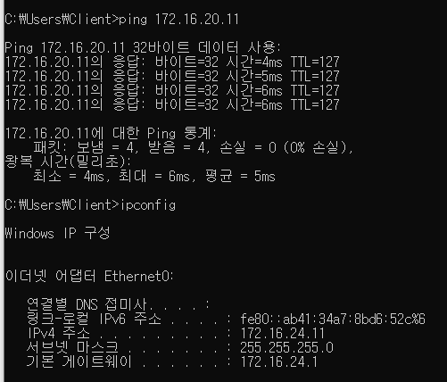

이 결과는 ACL 적용 전에 VLAN24와 VLAN20 사이에 L3 접근통제가 없었다는 Baseline Evidence다.

## 4.2 인터넷 접근

Guest Client에서 Public IP `8.8.8.8` 접근이 가능했다.

ACL 적용 후에도 동일 테스트가 성공해야 한다.

## 4.3 DNS

`www.google.com`에 대한 이름 해석과 Ping이 정상적으로 수행되었다.

따라서 ACL 적용 이후에도 DNS가 정상인지 Regression Test를 수행한다.

---

# 5. 설계 원칙

## 5.1 Source VLAN 기준 IN ACL

Guest 정책은 Backbone/Core의 VLAN24 SVI에서 **IN 방향**으로 적용한다.

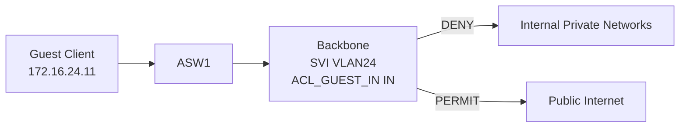

`IN`은 Backbone 관점에서 VLAN24에서 들어오는 트래픽을 의미한다.

## 5.2 RFC1918 전체 차단

Guest가 현재 존재하는 VLAN뿐 아니라 향후 추가될 사설망에도 접근하지 못하도록 개별 VLAN이 아닌 RFC1918 Private Prefix 전체를 차단한다.

```text
10.0.0.0/8
172.16.0.0/12
192.168.0.0/16
```

## 5.3 DHCP 예외

DHCP Client는 주소를 받기 전 다음과 같이 동작할 수 있다.

```text
Source      0.0.0.0
Destination 255.255.255.255
UDP         68 → 67
```

따라서 정상 VLAN24 Source만 허용하는 규칙 전에 DHCP Client Traffic을 명시적으로 허용한다.

## 5.4 Gateway ICMP 예외

`172.16.24.1`은 `172.16.0.0/12` 안에 포함된다.

Lab의 장애 진단 편의를 위해 Guest 자신의 Default Gateway에 대한 ICMP Echo는 별도로 허용한다.

---

# 6. 최종 접근통제 정책

| Seq | Source | Destination | Protocol / Service | Action | 목적 |
|---:|---|---|---|---|---|
| 20 | DHCP Client | DHCP Server/Broadcast | UDP 68→67 | PERMIT | DHCP 주소 할당 및 갱신 |
| 40 | `172.16.24.0/24` | `172.16.24.1` | ICMP Echo | PERMIT | Gateway 진단 |
| 60 | `172.16.24.0/24` | `10.0.0.0/8` | IP Any | DENY | Private/Infrastructure 차단 |
| 70 | `172.16.24.0/24` | `172.16.0.0/12` | IP Any | DENY | 내부 업무망 차단 |
| 80 | `172.16.24.0/24` | `192.168.0.0/16` | IP Any | DENY | Private Network 차단 |
| 100 | `172.16.24.0/24` | Any | IP Any | PERMIT | Public Internet 허용 |
| 120 | Any | Any | IP Any | DENY | 비정상/예상 외 Source 차단 |

---

# 7. 실제 Cisco ACL 설정

```cisco
ip access-list extended ACL_GUEST_IN

 20 permit udp any eq bootpc any eq bootps

 40 permit icmp 172.16.24.0 0.0.0.255 host 172.16.24.1 echo

 60 deny ip 172.16.24.0 0.0.0.255 10.0.0.0 0.255.255.255

 70 deny ip 172.16.24.0 0.0.0.255 172.16.0.0 0.15.255.255

 80 deny ip 172.16.24.0 0.0.0.255 192.168.0.0 0.0.255.255

 100 permit ip 172.16.24.0 0.0.0.255 any

 120 deny ip any any
```

---

# 8. SVI 적용

```cisco
configure terminal

interface Vlan24
 ip access-group ACL_GUEST_IN in

end
```

적용 상태:

```text
Vlan24 is up, line protocol is up
Internet address is 172.16.24.1/24
Helper address is 172.16.10.10
Outgoing access list is not set
Inbound access list is ACL_GUEST_IN
```

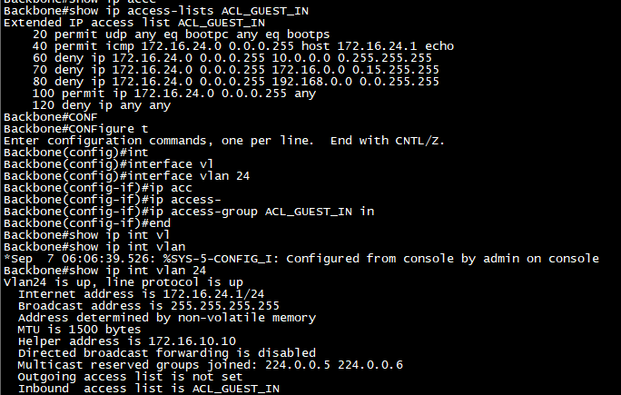

---

# 9. Negative Test — 내부망 접근 차단

ACL 적용 후:

```cmd
ping 172.16.20.11
```

결과:

```text
172.16.24.1의 응답:
대상 네트워크에 연결할 수 없습니다.
```

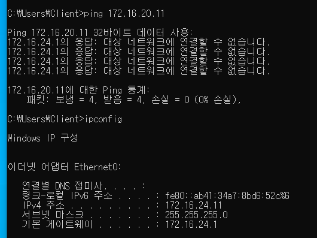

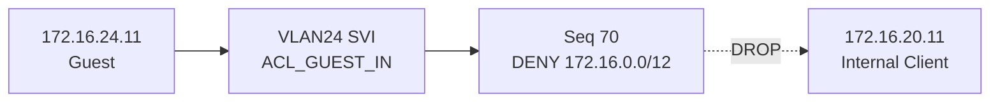

---

# 10. Positive Test — Default Gateway

```cmd
ping 172.16.24.1
```

정상적으로 응답했다.

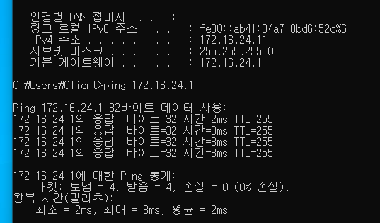

---

# 11. Positive Test — Internet

```cmd
ping 8.8.8.8
```

정상적으로 응답했다.

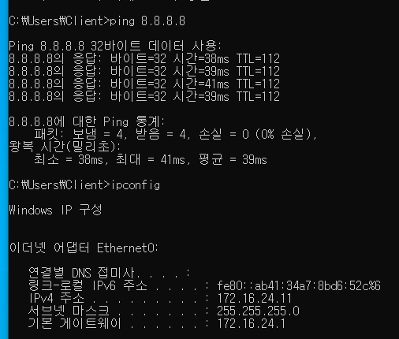

---

# 12. Positive Test — DNS

```cmd
ping www.google.com
```

Public IP가 정상적으로 해석되었고 Ping 응답도 성공했다.

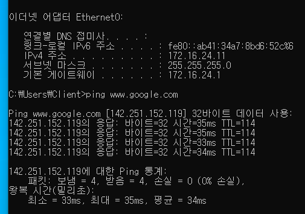

---

# 13. DHCP Regression Test

Guest Windows에서:

```cmd
ipconfig /release
ipconfig /renew
```

를 수행했다.

갱신 후:

```text
IPv4 Address    172.16.24.11
Subnet Mask     255.255.255.0
Default Gateway 172.16.24.1
```

가 정상적으로 다시 할당되었다.

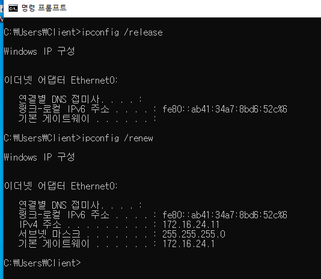

---

# 14. ACL Counter 검증

```cisco
show ip access-lists ACL_GUEST_IN
```

확인된 결과:

```text
20 permit udp any eq bootpc any eq bootps
   (5 matches)

40 permit icmp 172.16.24.0 0.0.0.255 host 172.16.24.1 echo
   (8 matches)

70 deny ip 172.16.24.0 0.0.0.255 172.16.0.0 0.15.255.255
   (16 matches)

100 permit ip 172.16.24.0 0.0.0.255 any
   (109 matches)
```

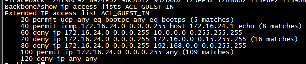

Counter 해석:

| Rule | 실제 의미 |
|---|---|
| Seq 20 | DHCP Release/Renew Traffic |
| Seq 40 | Gateway ICMP |
| Seq 70 | 내부 `172.16.x.x` 접근 차단 |
| Seq 100 | Internet/Public Traffic 허용 |

---

# 15. 최종 Packet Flow

## 내부망 접근

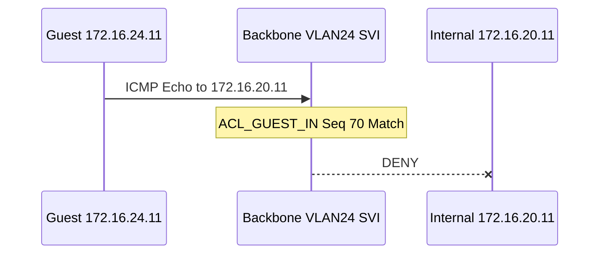

## Internet 접근

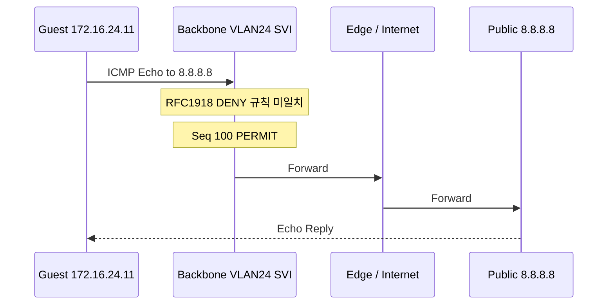

---

# 16. 보안 관점의 의미

기존:

```text
802.1X
   ↓
VLAN24
   ↓
Routing 가능
```

현재:

```text
802.1X
   ↓
Dynamic VLAN24
   ↓
ACL_GUEST_IN
   │
   ├── DHCP              PERMIT
   ├── Gateway           PERMIT
   ├── Internal RFC1918  DENY
   └── Public Internet   PERMIT
```

즉 **Identity → Dynamic VLAN → L3 Network Authorization Policy**가 실제로 연결되었다.

---

# 17. 트러블슈팅 기준

## 내부망이 계속 접근되는 경우

```cisco
show ip interface Vlan24
show ip access-lists ACL_GUEST_IN
```

확인 항목:

```text
ACL이 Vlan24에 Binding 되었는가?
방향이 IN인가?
Guest Source가 172.16.24.0/24인가?
Seq 70 Counter가 증가하는가?
Traffic이 실제 VLAN24 SVI를 통과하는가?
```

## Internet까지 차단되는 경우

```cmd
ping 172.16.24.1
```

후:

```cisco
show ip access-lists ACL_GUEST_IN
```

Seq 100 Counter를 확인한다.

## DHCP가 실패하는 경우

```cisco
show ip access-lists ACL_GUEST_IN
show running-config interface Vlan24
```

에서:

```text
Seq 20 DHCP Permit
ip helper-address 172.16.10.10
```

을 확인한다.

---

# 18. Rollback

문제 발생 시 ACL Object를 먼저 삭제하지 않고 Interface Binding을 제거한다.

```cisco
configure terminal

interface Vlan24
 no ip access-group ACL_GUEST_IN in

end
```

필요 시 이후 ACL Object 삭제:

```cisco
configure terminal

no ip access-list extended ACL_GUEST_IN

end
```

---

# 19. 완료 조건

## 설계
- [x] VLAN24 Guest 보안 정책 정의
- [x] Source VLAN SVI IN 방식 선택
- [x] RFC1918 전체 차단 정책 적용
- [x] DHCP 예외 설계
- [x] Gateway ICMP 예외 설계

## 구현
- [x] `ACL_GUEST_IN` 생성
- [x] ACL Dry-Run 확인
- [x] `interface Vlan24` IN 방향 적용
- [x] `show ip interface Vlan24` Binding 확인

## Negative Test
- [x] VLAN24 → VLAN20 `172.16.20.11` 접근 차단
- [x] RFC1918 내부망 차단 Rule Counter 확인

## Positive Test
- [x] VLAN24 → `172.16.24.1` Gateway Ping 성공
- [x] VLAN24 → `8.8.8.8` Internet Ping 성공
- [x] DNS Resolution 성공

## Regression Test
- [x] Guest 802.1X 인증 정상
- [x] Dynamic VLAN24 유지
- [x] DHCP Release/Renew 성공
- [x] Guest IP `172.16.24.11` 정상 재할당
- [x] Default Gateway `172.16.24.1` 정상
- [x] ACL Match Counter 정상

## 운영
- [x] Rollback 절차 정의
- [x] Evidence 확보

---

# 20. 최종 결과

```text
Guest A10014
       ↓
802.1X
       ↓
Dynamic VLAN24
       ↓
172.16.24.11
       ↓
ACL_GUEST_IN
       │
       ├── DHCP              PERMIT
       ├── Gateway           PERMIT
       ├── Internal RFC1918  DENY
       └── Public Internet   PERMIT
```

Guest VLAN24는 이제 단순히 논리적으로 분리된 VLAN이 아니라 실제 접근정책이 적용된 제한된 Security Zone으로 동작한다.

---

# 21. 다음 단계

다음 ACL 적용 대상은 **VLAN80 Dormitory**다.

Guest ACL을 그대로 복사하지 않고 먼저 VLAN80의 실제 역할, Gateway, DHCP/DNS 의존성, Internet 경로, 내부 접근 Baseline을 확인한 뒤 별도 Access Matrix를 작성한다.

예정 순서:

```text
Phase 3-2
VLAN80 Dormitory
       ↓
Baseline
       ↓
Access Matrix
       ↓
ACL_DORM_IN
       ↓
Positive / Negative Test
       ↓
Regression Test
       ↓
Documentation
```

그 이후:

```text
VLAN98 AuthFail
VLAN99 AuthStart
VLAN23 Partner
VLAN21 Research
VLAN22 Business
VLAN20 Security
```

순으로 정책 복잡도를 높인다.
