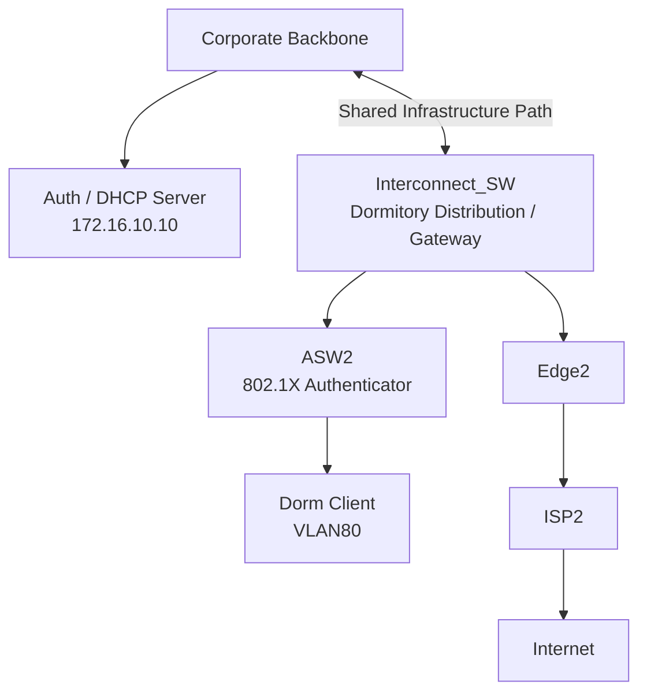
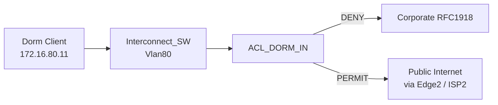
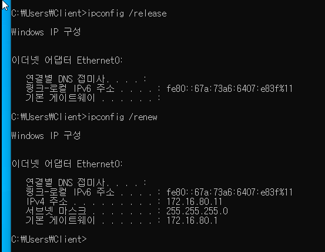
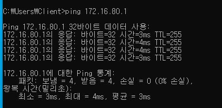
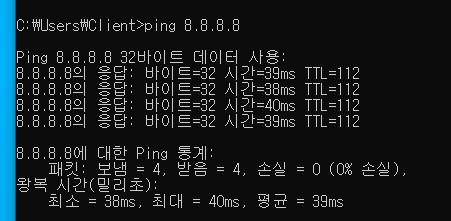
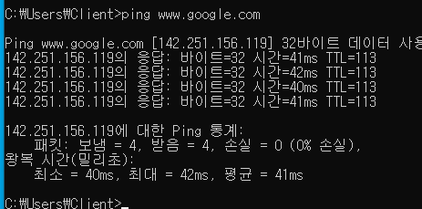
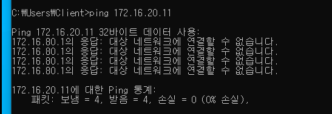
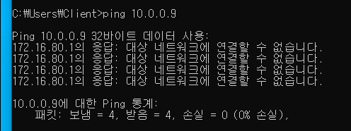
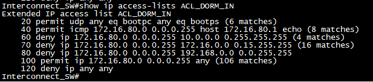
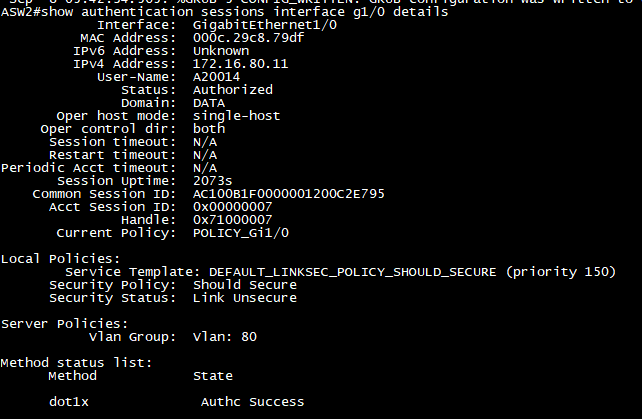

# Phase 3-2. Dormitory VLAN80 접근통제 구축

> **상태:** ✅ 완료  
> **대상 VLAN:** VLAN80 Dormitory  
> **대상 네트워크:** `172.16.80.0/24`  
> **Default Gateway:** `172.16.80.1`  
> **802.1X 사용자:** `A20014`  
> **Supplicant MAC:** `00:0c:29:c8:79:df`  
> **Authenticator:** `ASW2 Gi1/0`  
> **Policy Enforcement Point:** `Interconnect_SW interface Vlan80`  
> **ACL:** `ACL_DORM_IN`  
> **Internet Egress:** `Interconnect_SW → Edge2 → ISP2`

---

## 1. 목표

Dormitory VLAN80을 별도 Low-Trust Security Zone으로 유지하면서 다음 정책을 적용한다.

```text
Dormitory VLAN80
172.16.80.0/24
        │
        ├── DHCP                  PERMIT
        ├── Own Gateway          PERMIT
        ├── RFC1918 Private      DENY
        └── Public Internet      PERMIT
                                  │
                                  ▼
                               Edge2
                                  │
                                  ▼
                                 ISP2
```

핵심 원칙:

```text
Routing은 "길이 존재하는가"를 결정
ACL은 "통신해도 되는가"를 결정
```

ACL 적용 전에도 VLAN80에서 VLAN20으로의 통신은 실패했지만, 그 원인은 보안정책이 아니라 `Interconnect_SW`의 Routing Table에 `172.16.20.0/24` Specific Route가 없었기 때문이다.

이번 단계에서는 향후 Core/OSPF 구조가 변경되더라도 Dormitory 사용자의 Corporate 접근이 자동으로 열리지 않도록 **명시적인 L3 접근통제**를 추가한다.

---

## 2. Dormitory 네트워크 아키텍처

ISP2는 Dormitory 전용 Internet Egress로 유지한다.



User Data Plane:

```text
Dorm Client
   ↓
ASW2
   ↓
Interconnect_SW
   ↓
Edge2
   ↓
ISP2
```

Infrastructure Control Plane:

```text
ASW2
   ↓ RADIUS / Accounting
172.16.10.10

Interconnect_SW
   ↓ DHCP Relay
172.16.10.10
```

---

## 3. 선행 트러블슈팅 1 — ASW2 RADIUS Server 설정 누락

### 증상

Dorm Client는 ASW2와 EAPOL 교환을 시작했지만 인증이 실패했고, `Interconnect_SW ↔ Backbone` 구간에서 RADIUS UDP/1812 트래픽이 보이지 않았다.

### 확인

- Dorm Client → ASW2 EAPOL 정상
- Backbone ↔ Interconnect_SW Transit Ping 정상
- Interconnect_SW → `172.16.10.10` Route 존재
- FreeRADIUS Server tcpdump에서 UDP/1812 Request 없음

### Root Cause

ASW2의 AAA Framework는 존재했지만 **실제 RADIUS Server 정의가 누락**되어 있었다.

### 해결

정상 동작 중인 ASW1 설정을 기준으로 ASW2에 FreeRADIUS Server를 정의했다.

### 결과

FreeRADIUS에서 다음이 확인되었다.

```text
User-Name = A20014
NAS-IP-Address = 172.16.11.31
NAS-Port-Id = GigabitEthernet1/0
Calling-Station-Id = 00-0C-29-C8-79-DF
```

PEAP/MSCHAPv2 인증과 Dynamic VLAN80 할당이 정상화되었다.

---

## 4. 선행 트러블슈팅 2 — DHCPDISCOVER만 반복

### 증상

802.1X는 성공했고 ASW2에서:

```text
Status: Authorized
Vlan Group: Vlan: 80
dot1x: Authc Success
```

가 확인되었지만 Windows Client는 `169.254.x.x` APIPA 주소를 사용했다.

Packet Capture에서는 DHCP `DISCOVER`만 반복되고 `OFFER`가 나타나지 않았다.

### Network Path 검증

ASW2 Trunk에서 VLAN80은:

```text
allowed       ✅
active        ✅
STP forwarding ✅
```

Interconnect_SW:

```cisco
interface Vlan80
 ip address 172.16.80.1 255.255.255.0
 ip helper-address 172.16.10.10
```

DHCP Server tcpdump:

```text
172.16.80.1:67
    →
172.16.10.10:67

BOOTP/DHCP Request
Client MAC 00:0c:29:c8:79:df
```

즉 Network Path와 DHCP Relay는 정상이었다.

### Root Cause

`/etc/dhcp/dhcpd.conf`에 `172.16.80.0/24` subnet 정의가 없었다.

DHCP Server는 Relay Request를 수신했지만 VLAN80에 사용할 Scope를 찾지 못해 `DHCPOFFER`를 생성하지 못했다.

### 해결

VLAN80 Scope를 DHCP 설정에 추가하고 실제 `dhcpd.conf`에 반영했다.

### 결과

```text
IPv4 Address    172.16.80.11
Subnet Mask     255.255.255.0
Default Gateway 172.16.80.1
```

정상 할당이 확인되었다.

---

## 5. ACL 적용 전 Baseline

| 항목 | 결과 |
|---|---|
| 802.1X A20014 | 성공 |
| Dynamic VLAN80 | 성공 |
| IPv4 | `172.16.80.11/24` |
| Gateway | `172.16.80.1` |
| Gateway Ping | 성공 |
| Internet `8.8.8.8` | 성공 |
| DNS | 성공 |
| VLAN20 `172.16.20.11` | 실패 |
| VLAN80 ACL | 미적용 |

VLAN20 접근 실패는 ACL이 아니라 Route 부재 때문이었다.

```text
172.16.20.11
        ↓
Specific Route 없음
        ↓
Default Route
        ↓
Edge2 / ISP2
        ↓
실패
```

---

## 6. 설계 원칙 — Routing Isolation + ACL Enforcement

```text
Routing Isolation
+
ACL Enforcement
```

두 계층을 함께 사용한다.

나중에 `172.16.20.0/24` 같은 Corporate Prefix가 DORM 쪽 Routing Table에 추가되어도 ACL이 먼저 차단한다.



---

## 7. 최종 Access Matrix

| Seq | Source | Destination | Service | Action | 목적 |
|---:|---|---|---|---|---|
| 20 | DHCP Client | DHCP | UDP 68→67 | PERMIT | IP 할당/갱신 |
| 40 | `172.16.80.0/24` | `172.16.80.1` | ICMP Echo | PERMIT | Gateway 진단 |
| 60 | `172.16.80.0/24` | `10.0.0.0/8` | IP Any | DENY | Transit/Private 보호 |
| 70 | `172.16.80.0/24` | `172.16.0.0/12` | IP Any | DENY | Corporate/Internal 보호 |
| 80 | `172.16.80.0/24` | `192.168.0.0/16` | IP Any | DENY | Private Network 보호 |
| 100 | `172.16.80.0/24` | Any | IP Any | PERMIT | Public Internet |
| 120 | Any | Any | IP Any | DENY | 비정상 Source 차단 |

---

## 8. 실제 ACL 설정

```cisco
ip access-list extended ACL_DORM_IN

 20 permit udp any eq bootpc any eq bootps
 40 permit icmp 172.16.80.0 0.0.0.255 host 172.16.80.1 echo
 60 deny ip 172.16.80.0 0.0.0.255 10.0.0.0 0.255.255.255
 70 deny ip 172.16.80.0 0.0.0.255 172.16.0.0 0.15.255.255
 80 deny ip 172.16.80.0 0.0.0.255 192.168.0.0 0.0.255.255
 100 permit ip 172.16.80.0 0.0.0.255 any
 120 deny ip any any
```

적용:

```cisco
interface Vlan80
 ip access-group ACL_DORM_IN in
```

---

## 9. Positive Test — DHCP Release / Renew

```cmd
ipconfig /release
ipconfig /renew
```

정상적으로 `172.16.80.11/24`, Gateway `172.16.80.1`이 다시 할당되었다.



---

## 10. Positive Test — Default Gateway

```cmd
ping 172.16.80.1
```

성공.



Seq 40이 실제 Gateway Diagnostic Traffic을 허용한다.

---

## 11. Positive Test — Internet

```cmd
ping 8.8.8.8
```

성공.



Flow:

```text
Dorm Client
   ↓
ACL_DORM_IN Seq100 PERMIT
   ↓
Interconnect_SW Routing
   ↓
Edge2
   ↓
ISP2
   ↓
Internet
```

---

## 12. Positive Test — DNS

```cmd
ping www.google.com
```

Public IP가 정상적으로 해석되고 Ping도 성공했다.



---

## 13. Negative Test — Corporate VLAN20 차단

```cmd
ping 172.16.20.11
```

차단됨.



ACL 적용 전에도 실패했지만, 적용 후에는 Seq 70 Counter가 증가해 **ACL이 직접 차단했다는 사실**을 증명했다.

```text
Before
Route 없음 → 실패

After
ACL_DORM_IN Seq70 → 명시적 DENY
```

---

## 14. Negative Test — Backbone Transit `10.0.0.9` 차단

```cmd
ping 10.0.0.9
```

차단됨.



이 테스트는 Seq 60의 `10.0.0.0/8` 보호 정책을 검증한다.

---

## 15. ACL Counter 검증

```cisco
show ip access-lists ACL_DORM_IN
```

실제 결과:

```text
20 permit udp any eq bootpc any eq bootps
   (6 matches)

40 permit icmp 172.16.80.0 0.0.0.255 host 172.16.80.1 echo
   (8 matches)

60 deny ip 172.16.80.0 0.0.0.255 10.0.0.0 0.255.255.255
   (4 matches)

70 deny ip 172.16.80.0 0.0.0.255 172.16.0.0 0.15.255.255
   (16 matches)

100 permit ip 172.16.80.0 0.0.0.255 any
   (106 matches)
```



| Seq | 의미 | Evidence |
|---:|---|---|
| 20 | DHCP | Release/Renew |
| 40 | Gateway 허용 | `172.16.80.1` Ping |
| 60 | Transit 차단 | `10.0.0.9` Ping |
| 70 | Corporate 차단 | `172.16.20.11` Ping |
| 100 | Public 허용 | Internet / DNS |

---

## 16. 802.1X Regression Test

ACL 적용 이후에도 인증 상태를 확인했다.

```text
MAC Address: 000c.29c8.79df
IPv4 Address: 172.16.80.11
User-Name: A20014
Status: Authorized
Domain: DATA
Vlan Group: Vlan: 80

dot1x
Authc Success
```



즉 SVI L3 ACL이 EAPOL 기반 802.1X 인증에는 영향을 주지 않았다.

---

## 17. Before / After 비교

### Before ACL

```text
Dorm → VLAN20
        ↓
Specific Route 없음
        ↓
Default Route
        ↓
Edge2
        ↓
실패
```

### After ACL

```text
Dorm → VLAN20
        ↓
Vlan80 SVI
        ↓
ACL_DORM_IN
        ↓
Seq70 DENY
        X
```

같은 Ping 실패지만, After 상태에서는 Routing 변화와 무관하게 Security Policy가 유지된다.

---

## 18. 보안 관점의 의미

Dormitory Network는 이제:

```text
전용 Internet Egress
+
Routing Isolation
+
Explicit ACL Enforcement
```

의 세 계층을 가진 별도 Security Zone으로 동작한다.

장기적으로는 Corporate ↔ Dormitory 경계에 Stateful Firewall을 추가할 수 있다.

```text
Corporate Core
      │
    DORM-FW
      │
 DORM_DIST
   /     ASW2    Edge2
         │
        ISP2
```

---

## 19. Rollback

```cisco
configure terminal

interface Vlan80
 no ip access-group ACL_DORM_IN in

end
```

필요 시 이후 ACL Object 삭제:

```cisco
configure terminal

no ip access-list extended ACL_DORM_IN

end
```

---

## 20. 완료 조건

### Authentication / VLAN
- [x] A20014 802.1X 성공
- [x] ASW2 `Authorized`
- [x] Dynamic VLAN80 적용
- [x] `dot1x Authc Success`

### DHCP
- [x] VLAN80 DHCP Scope 정상
- [x] `172.16.80.11` 할당
- [x] `/release → /renew` 성공
- [x] Gateway `172.16.80.1` 유지
- [x] Seq20 Counter 증가

### Positive Test
- [x] `172.16.80.1` Ping 성공
- [x] Seq40 Counter 증가
- [x] `8.8.8.8` Ping 성공
- [x] DNS 정상
- [x] Seq100 Counter 증가

### Negative Test
- [x] `172.16.20.11` 차단
- [x] Seq70 Counter 증가
- [x] `10.0.0.9` 차단
- [x] Seq60 Counter 증가

### Operational
- [x] Rollback 절차 정의
- [x] ACL Counter 검증
- [x] Evidence 확보

---

## 21. 최종 상태

```text
A20014
   ↓
802.1X
   ↓
Dynamic VLAN80
   ↓
172.16.80.11
   ↓
Interconnect_SW Vlan80
   ↓
ACL_DORM_IN
   │
   ├── DHCP               PERMIT
   ├── Own Gateway        PERMIT
   ├── RFC1918            DENY
   └── Public Internet    PERMIT
                             │
                             ▼
                          Edge2
                             │
                             ▼
                            ISP2
```

Phase 3-2는 **인증, VLAN, DHCP, 전용 ISP2 Egress, 내부망 차단을 모두 실제 Traffic과 ACL Counter로 검증한 상태**다.

---

## 22. 다음 단계

다음 우선순위는 NAC 제한망인 VLAN98 / VLAN99다.

```text
Phase 3-3
VLAN98 AuthFail
        ↓
Remediation / Restricted Network

Phase 3-4
VLAN99 AuthStart
        ↓
Onboarding 최소 접근
```

VLAN98/99는 Guest/Dormitory ACL을 그대로 복사하지 않는다.

먼저 다음을 설계한다.

```text
어떤 인증 상태에서 VLAN98/99에 들어가는가
↓
DHCP / DNS가 필요한가
↓
RADIUS / PKI / Remediation Portal 접근이 필요한가
↓
Internet을 허용할 것인가
↓
정상 인증 성공 후 어떤 VLAN으로 이동하는가
```
