# Phase 3-3. VLAN98 AuthFail / Quarantine Network 구축

> **상태:** ✅ AuthFail 전환 + DHCP + Quarantine ACL 검증 완료  
> **정상 사용자 테스트 계정:** `A10014`  
> **정상 Role:** `VLAN24 Guest`  
> **AuthFail Runtime VLAN:** `VLAN98`  
> **AuthFail Network:** `172.16.98.0/24`  
> **Gateway:** `172.16.98.1`  
> **Authenticator:** `ASW1 Gi1/1`  
> **Policy Enforcement Point:** `Backbone interface Vlan98`  
> **ACL:** `ACL_AUTHFAIL_IN`

---

## 1. 목표

VLAN98은 정상 사용자 Role이 아니라 **802.1X 인증 실패 시 사용하는 Runtime Fallback / Quarantine Network**로 정의한다.

이번 단계의 목표는 다음 End-to-End 흐름을 실제 장비와 로그로 검증하는 것이다.

```text
A10014
정상 Role = VLAN24
        │
        │ Wrong Password
        ▼
FreeRADIUS
Access-Reject
        │
        ▼
ASW1
authentication event fail
        │
        ▼
Restricted Authorization
VLAN98
        │
        ▼
DHCP
172.16.98.11
        │
        ▼
ACL_AUTHFAIL_IN
        │
        ├── DHCP / Own Gateway     PERMIT
        ├── Corporate Internal     DENY
        ├── Public Internet        DENY
        └── Remediation Service    향후 제한 PERMIT
```

핵심 설계 원칙은 다음과 같다.

> **Authentication Failure와 Network Authorization은 분리한다.**  
> 사용자의 자격증명 검증은 실패할 수 있지만, Switch는 해당 Endpoint를 완전히 방치하지 않고 VLAN98에서 제한적으로 Authorize할 수 있다.

---

## 2. VLAN98은 HR Department VLAN이 아니다

정상 Role VLAN과 AuthFail VLAN의 의미는 완전히 다르다.

### 정상 Role VLAN

```text
HR Oracle
employee
   ↓
department
   ↓
dept_vlan_map
   ↓
VLAN20 / 21 / 22 / 23 / 24 / 80
   ↓
radusergroup
   ↓
RADIUS Access-Accept
```

정상 Role은 사용자의 **Identity / Department / Policy**에 의해 결정된다.

### VLAN98 AuthFail

```text
정상 Role = VLAN24
        │
        │ 인증 시도
        ▼
Credential Verification FAIL
        │
        ▼
Switch Runtime Failure Policy
        │
        ▼
VLAN98
```

VLAN98은 사용자의 부서가 바뀐 것이 아니라 **현재 세션의 인증 상태가 실패한 것**을 의미한다.

따라서 VLAN98을 다음 위치에 넣지 않는다.

```text
dept_vlan_map     ❌
radusergroup      ❌
AuthFail 전용 사용자 계정 ❌
```

반면 Network Service를 제공하기 위한 다음 항목은 존재할 수 있다.

```text
dhcp_scope        ✅
dhcp_ip_pool      ✅
Backbone Vlan98   ✅
ACL_AUTHFAIL_IN   ✅
```

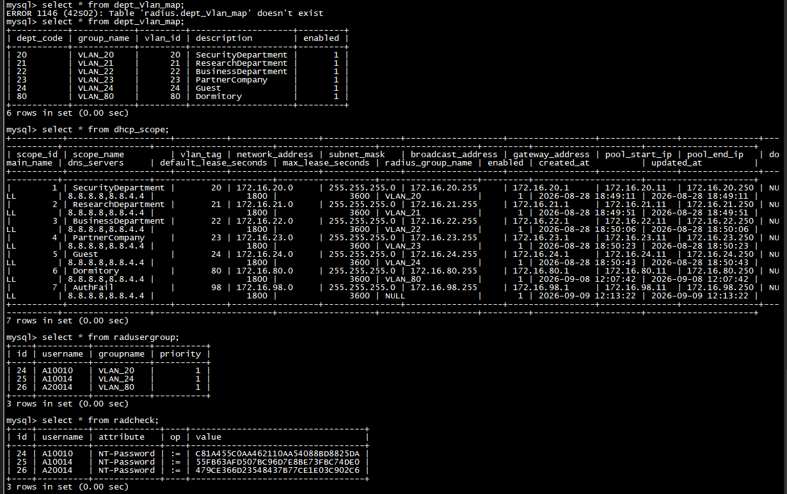

---

## 3. Desired / Applied / Runtime 상태 분리

이번 Phase에서 가장 중요한 데이터 모델 원칙이다.

A10014가 원래 Guest 사용자라면 다음 세 상태가 동시에 존재할 수 있다.

```text
HR Desired State
A10014 → VLAN24

RADIUS Applied State
A10014 → VLAN24

Runtime Session State
A10014 → AUTH_FAIL / VLAN98
```

즉:

```text
Desired = VLAN24
Applied = VLAN24
Runtime = VLAN98
```

은 모순이 아니다.

오히려 `radusergroup`을 VLAN98로 변경해버리면 다음 정상 인증에서도 VLAN98이 정상 Authorization 결과로 내려갈 수 있으므로 설계가 깨진다.

---

## 4. AuthFail 네트워크 사전 준비

### 4.1 Backbone VLAN98 SVI

```cisco
interface Vlan98
 ip address 172.16.98.1 255.255.255.0
 ip helper-address 172.16.10.10
```

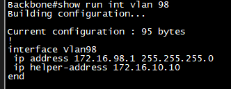

VLAN98 Client의 DHCP Broadcast는 Backbone에서 Relay되어 중앙 DHCP Server `172.16.10.10`으로 전달된다.

### 4.2 ASW1 Trunk

ASW1 Uplink에서 VLAN98이 다음 조건을 만족하는지 확인했다.

```text
VLAN98 존재
VLAN98 allowed on trunk
VLAN98 active
VLAN98 STP forwarding
```

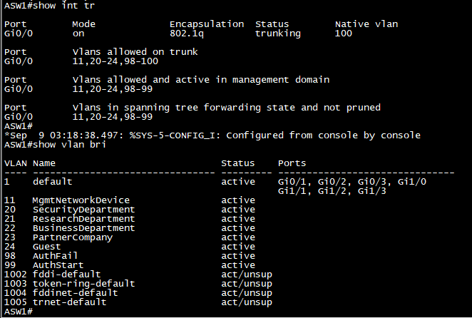

---

## 5. Cisco Authentication Event 모델 확인

ASW1에서 다음 Event를 지원하는 것을 확인했다.

```text
authentication event fail
authentication event no-response
authentication event server
```

이 세 Event는 NAC 상태를 다음처럼 분리할 수 있게 한다.

```text
FAIL
→ Credential / Identity / Policy 인증 실패
→ VLAN98 AuthFail

NO-RESPONSE
→ Supplicant 응답 없음
→ VLAN99 Onboarding 후보

SERVER DEAD
→ RADIUS/AAA 장애
→ 향후 Critical / Fail-Closed 정책
```

AuthFail Action 하위 명령에서 VLAN ID 지정도 지원되었다.


---

## 6. AuthFail Failure Action 구성

테스트 포트 `ASW1 Gi1/1`에 다음 Failure Action을 적용했다.

```cisco
interface GigabitEthernet1/1
 authentication event fail action authorize vlan 98
```

실습 환경에서는 인증 실패 후 Action이 예측 가능하게 실행되도록 Fail Retry 정책도 함께 조정하여 테스트했다.

> 운영 환경의 Retry 횟수는 사용자 UX, Helpdesk 정책, Brute-Force 대응 정책을 함께 고려해 별도로 결정해야 한다.

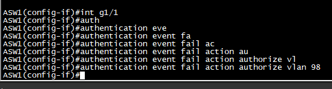

---

## 7. 테스트 조건

정상 RADIUS/HR Policy는 변경하지 않았다.

```text
A10014
radcheck      = 정상 Credential 유지
radusergroup  = VLAN_24 유지
HR Desired    = VLAN24 유지
```

Client에서만 **의도적으로 잘못된 비밀번호**를 입력했다.

이 테스트의 목적은 다음을 증명하는 것이다.

```text
정상 Role 정보는 VLAN24 그대로 유지

하지만

이번 Runtime Authentication은 실패

따라서

Switch Local Failure Policy가 VLAN98 적용
```

---

## 8. Authentication Fail과 Restricted Authorization

FreeRADIUS에서는 잘못된 Credential에 대해 `Access-Reject`가 발생했다.

Switch에서는 802.1X 인증 결과가 실패로 기록되었지만, Failure Action에 의해 Session은 Restricted VLAN98에서 Authorize되었다.

`show authentication sessions interface Gi1/1 details` 결과의 핵심은 다음과 같다.

```text
User-Name: A10014
Status: Authorized

Local Policies:
  AUTH_FAIL_VLAN_Gi1/1
  Vlan Group: Vlan: 98

Method status:
  dot1x
  Authc Failed
```

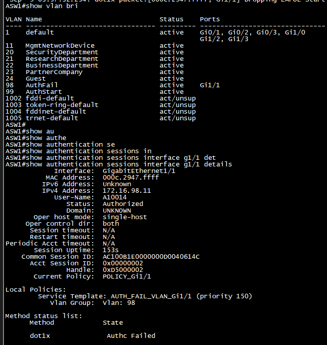

이 상태는 모순이 아니다.

```text
Authentication
Authc Failed
        │
        ▼
Switch Failure Action
        │
        ▼
Authorization
Restricted Success
        │
        ▼
VLAN98
```

즉 **인증은 실패했지만 VLAN98에서 제한된 네트워크 사용은 허용된 상태**다.

---

## 9. Windows의 "인증 실패"와 "네트워크 변경"은 동시에 나타날 수 있다

Windows Supplicant는 Credential Authentication 결과를 기준으로 `인증 실패`를 표시할 수 있다.

하지만 Switch는 별도의 Local Failure Policy에 따라 VLAN98을 부여한다.

따라서 Windows UI에서:

```text
802.1X 인증 실패
+
새 Network Profile
```

이 동시에 나타나는 것은 정상적인 현상이다.

같은 물리 NIC라도:

```text
VLAN24 / 172.16.24.0/24
        ↓
VLAN98 / 172.16.98.0/24
```

로 L3 Network가 변경되면 Windows는 새로운 네트워크로 인식할 수 있다.

---

## 10. VLAN98 DHCP 성공

AuthFail VLAN으로 이동한 Client는 DHCP를 통해 다음 주소를 획득했다.

```text
IPv4 Address    172.16.98.11
Subnet Mask     255.255.255.0
Default Gateway 172.16.98.1
```

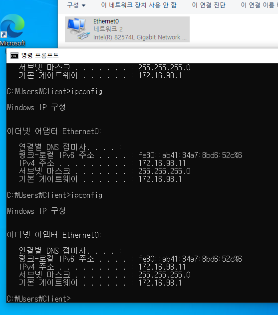

Gateway Ping도 정상이다.

```cmd
ping 172.16.98.1
```

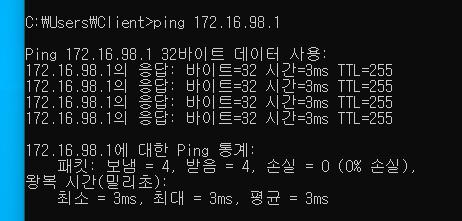

이 시점까지의 Flow:

```text
Wrong Credential
      ↓
Access-Reject
      ↓
AuthFail VLAN98
      ↓
DHCP Relay
      ↓
172.16.98.11
      ↓
172.16.98.1 Reachable
```

---

## 11. ACL 적용 전 Baseline

ACL을 적용하기 전에 VLAN98의 실제 Reachability를 확인했다.

### 11.1 Corporate 내부망

`172.16.10.1` 방향은 Routing이 존재하므로 Ping이 성공했다.

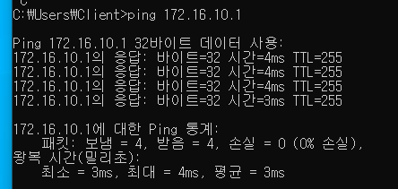

이 결과는 VLAN98이 **ACL 적용 전에는 내부망 접근이 가능한 상태**라는 중요한 Before Evidence다.

### 11.2 Internet / DNS

`8.8.8.8`과 `www.google.com`은 실패했다.

원인은 VLAN98 ACL이 아니었다.

Edge1 NAT 설정에서 NAT 대상 Network는 다음 정상망 중심으로 구성되어 있었고 VLAN98 `172.16.98.0/24`는 포함되지 않았다.

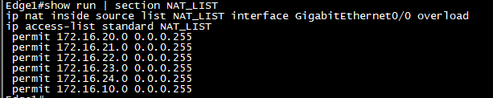

따라서:

```text
172.16.98.11
      ↓
Edge1
      ↓
NAT_LIST
      ↓
172.16.98.0/24 Match 없음
      ↓
NAT 변환 없음
      ↓
Internet 실패
```

Public DNS 역시 `8.8.8.8 / 8.8.4.4`를 사용하므로 Internet 경로가 없어 실패했다.

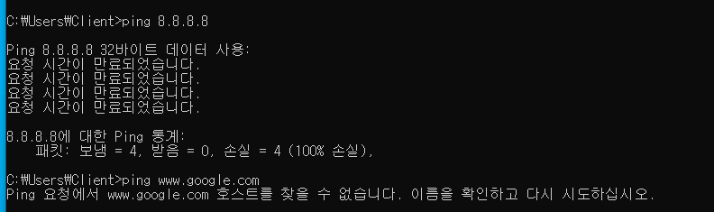

### 중요한 해석

이 상태를 보안정책으로 간주하지 않는다.

```text
현재 Internet 차단
= NAT 대상이 아니어서 결과적으로 실패

최종 Internet 차단
= ACL_AUTHFAIL_IN에서 명시적으로 DENY
```

NAT omission은 Defense-in-Depth의 한 층일 뿐, 정책 Enforcement Point는 VLAN98 ACL로 명확히 만든다.

---

## 12. VLAN98 Quarantine Policy

VLAN98은 Guest/Dormitory보다 더 낮은 Trust Zone으로 정의한다.

초기 정책은 다음과 같다.

| Seq | Source | Destination | Service | Action | 목적 |
|---:|---|---|---|---|---|
| 20 | DHCP Client | DHCP | UDP 68→67 | PERMIT | 주소 할당/갱신 |
| 40 | `172.16.98.0/24` | `172.16.98.1` | ICMP Echo | PERMIT | Own Gateway 진단 |
| 60 | `172.16.98.0/24` | `10.0.0.0/8` | IP Any | DENY | Transit/Private 보호 |
| 70 | `172.16.98.0/24` | `172.16.0.0/12` | IP Any | DENY | Corporate 보호 |
| 80 | `172.16.98.0/24` | `192.168.0.0/16` | IP Any | DENY | Private Network 보호 |
| 100 | `172.16.98.0/24` | Any | IP Any | DENY | Public Internet 차단 |
| 120 | Any | Any | IP Any | DENY | Catch-All |

현재 Remediation Portal은 존재하지 않으므로 **DHCP + Own Gateway 이외의 일반 사용자 Traffic은 기본 차단**한다.

향후 Password Reset / PKI / NAC Help Portal이 추가되면 필요한 Destination과 Port만 Seq 40~60 사이에 제한적으로 Permit한다.

---

## 13. 실제 ACL

```cisco
ip access-list extended ACL_AUTHFAIL_IN

 20 permit udp any eq bootpc any eq bootps

 40 permit icmp 172.16.98.0 0.0.0.255 host 172.16.98.1 echo

 60 deny ip 172.16.98.0 0.0.0.255 10.0.0.0 0.255.255.255

 70 deny ip 172.16.98.0 0.0.0.255 172.16.0.0 0.15.255.255

 80 deny ip 172.16.98.0 0.0.0.255 192.168.0.0 0.0.255.255

 100 deny ip 172.16.98.0 0.0.0.255 any

 120 deny ip any any
```

Policy Enforcement Point:

```cisco
interface Vlan98
 ip access-group ACL_AUTHFAIL_IN in
```

---

## 14. ACL 적용 후 DHCP Regression

```cmd
ipconfig /release
ipconfig /renew
```

ACL 적용 후에도:

```text
172.16.98.11/24
Gateway 172.16.98.1
```

이 정상적으로 재할당되었다.

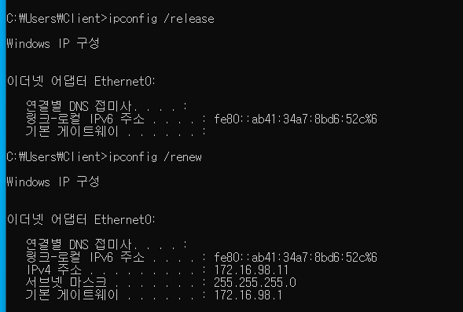

즉 Seq20 DHCP Permit과 Backbone `ip helper-address`가 정상 동작한다.

---

## 15. ACL 적용 후 Positive / Negative Test

### 15.1 Own Gateway

`172.16.98.1`은 정상적으로 통신 가능하다.

```text
VLAN98 Client
     ↓
Seq40 Permit
     ↓
172.16.98.1
```

### 15.2 Corporate `172.16.10.1`

ACL 적용 전에는 성공했지만 적용 후 차단되었다.

```text
172.16.98.11
      ↓
172.16.10.1
      ↓
Seq70
172.16.0.0/12
      ↓
DENY
```

### 15.3 Internet `8.8.8.8`

ACL 적용 후에도 차단된다.

이번에는 단순히 NAT가 없어서 실패하는 것에 더해 `ACL_AUTHFAIL_IN Seq100`이 명시적으로 Public Traffic을 차단한다.

### 15.4 DNS

`www.google.com` 이름 해석도 실패한다.

이는 현재 VLAN98이 Public DNS Server를 DHCP Option으로 받더라도 Public Traffic 자체를 차단하는 정책이기 때문이다.

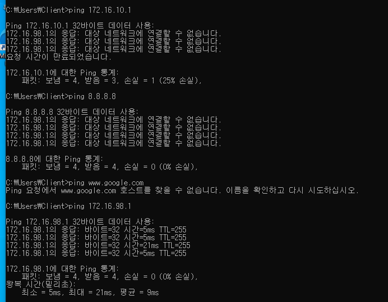

---

## 16. Windows Ping 통계 해석 주의

ACL 차단 시 Windows가 다음과 같이 표시할 수 있다.

```text
172.16.98.1의 응답:
대상 네트워크에 연결할 수 없습니다.
```

그리고 Ping 통계가 일부 또는 전부 `받음`으로 계산될 수 있다.

이것은 목적지에서 `ICMP Echo Reply`가 돌아온 것이 아니다.

```text
ICMP Echo Reply             ❌
ICMP Destination Unreachable ✅
```

Gateway가 보낸 ICMP 오류 패킷을 Windows가 응답으로 계산할 수 있기 때문이다.

따라서 단순 `손실률`만으로 성공 여부를 판단하지 않고 다음을 함께 확인한다.

```text
응답 출발지
응답 메시지 종류
ACL Counter
Packet Capture
```

---

## 17. ACL Counter 검증

실제 `ACL_AUTHFAIL_IN` Counter:

```text
20 permit udp any eq bootpc any eq bootps
   (6 matches)

40 permit icmp 172.16.98.0 0.0.0.255 host 172.16.98.1 echo
   (8 matches)

60 deny ip 172.16.98.0 0.0.0.255 10.0.0.0 0.255.255.255
   (0 matches)

70 deny ip 172.16.98.0 0.0.0.255 172.16.0.0 0.15.255.255
   (16 matches)

80 deny ip 172.16.98.0 0.0.0.255 192.168.0.0 0.0.255.255
   (0 matches)

100 deny ip 172.16.98.0 0.0.0.255 any
   (88 matches)

120 deny ip any any
```

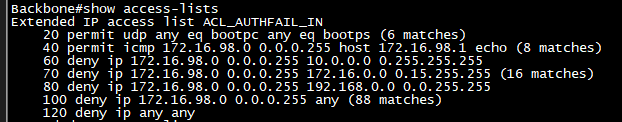

해석:

| Seq | 검증 내용 | 결과 |
|---:|---|---|
| 20 | DHCP Release/Renew | ✅ Match |
| 40 | Own Gateway | ✅ Match |
| 60 | `10.0.0.0/8` | 이번 테스트 미실시 |
| 70 | Corporate `172.16.10.1` | ✅ DENY Match |
| 80 | `192.168.0.0/16` | 이번 테스트 미실시 |
| 100 | Public Internet / DNS | ✅ DENY Match |

Counter는 단순 Ping 실패보다 강한 Evidence다.

특히 `172.16.10.1`은 ACL 적용 전 통신이 가능했기 때문에:

```text
Before
Internal Reachable

After
Seq70 Explicit DENY
```

가 명확하게 증명된다.

---

## 18. Defense-in-Depth 구조

VLAN98 Internet 차단은 현재 두 층으로 구성된다.

```text
Layer 1
ACL_AUTHFAIL_IN
→ Public IP Explicit DENY

Layer 2
Edge1 NAT_LIST
→ VLAN98 NAT 대상 아님
```

즉 ACL을 실수로 완화하더라도 현재 NAT 경계가 추가적인 방어선 역할을 한다.

하지만 **NAT는 보안정책의 주 Enforcement Point로 간주하지 않는다.**

---

## 19. Known Limitation 1 — VLAN98/99 DHCP Reservation

> **중요: 현재 구현은 최종 DHCP Lifecycle 정책이 아니다.**

현재 DHCP 자동화는 정상 Role VLAN과 Runtime Fallback VLAN을 아직 구분하지 않는다.

따라서 VLAN98에서 최초 DHCPACK이 발생하면 기존 `AUTO_FIRST_LEASE` 로직에 의해 다음이 발생할 수 있다.

```text
network_lease_log
        ↓
AUTO_FIRST_LEASE
        ↓
dhcp_reservation
        ↓
172.16.98.x Persistent Reservation
        ↓
dhcp_ip_pool.pool_state = RESERVED
```

하지만 VLAN98/99는 일시적인 Runtime State이므로 장기적으로 Persistent Reservation을 생성하는 것이 적절하지 않다.

예를 들어 많은 사용자가 한 번씩 인증에 실패하면:

```text
172.16.98.11 RESERVED
172.16.98.12 RESERVED
172.16.98.13 RESERVED
...
```

가 누적되어 실제 사용자가 없어도 Pool이 고갈될 수 있다.

### 최종 개선 방향

VLAN별로 DHCP Lifecycle Policy를 데이터로 표현한다.

권장 예:

```text
VLAN20  PERSISTENT
VLAN21  PERSISTENT
VLAN22  PERSISTENT
VLAN23  PERSISTENT
VLAN24  PERSISTENT
VLAN80  PERSISTENT

VLAN98  DYNAMIC_ONLY
VLAN99  DYNAMIC_ONLY
```

권장 Schema 방향:

```text
dhcp_scope.lease_policy

PERSISTENT
DYNAMIC_ONLY
```

또는:

```text
dhcp_scope.auto_reservation_enabled
```

현재 Phase에서는 AuthFail Networking 자체를 검증하기 위해 기존 Reservation 로직을 **의도적으로 변경하지 않았다.**

VLAN98/99에서 생성된 Reservation은 최종 운영용 영구 상태로 간주하지 않는다.

---

## 20. Known Limitation 2 — VLAN98 Public DNS Option

현재 VLAN98 DHCP Scope는 Public DNS:

```text
8.8.8.8
8.8.4.4
```

를 배포하지만 `ACL_AUTHFAIL_IN`은 Public Traffic을 차단한다.

따라서 현재 Client는 DNS 주소를 가지고 있어도 실제 Public DNS를 사용할 수 없다.

이는 기능상 오류라기보다 **Remediation Architecture가 아직 미구현인 중간 설계 상태**다.

향후 다음 중 하나로 정리한다.

```text
Option A
VLAN98에서 DNS Option 제거

Option B
내부 Remediation DNS만 제공

Option C
Remediation에 필요한 DNS/Portal Destination만 제한 Permit
```

일반 Internet Access를 VLAN98에 허용하는 방향은 기본 정책으로 채택하지 않는다.

---

## 21. Rollback

### ACL만 제거

```cisco
configure terminal

interface Vlan98
 no ip access-group ACL_AUTHFAIL_IN in

end
```

AuthFail VLAN 자체는 유지하면서 ACL만 제거할 수 있다.

### AuthFail Failure Action 제거

```cisco
configure terminal

interface GigabitEthernet1/1
 no authentication event fail action authorize vlan 98

end
```

운영 변경 시에는 한 번에 두 기능을 동시에 제거하지 않고 ACL과 Authentication Failure Policy를 단계적으로 Rollback한다.

---

## 22. 완료 조건

### Identity / Policy Separation
- [x] VLAN98을 `dept_vlan_map`에 추가하지 않음
- [x] VLAN98을 `radusergroup` 정상 Role로 사용하지 않음
- [x] A10014 정상 Role은 VLAN24 유지
- [x] VLAN98 DHCP Scope/Pool은 Network Service로만 존재

### Authentication Failure
- [x] Wrong Password 사용
- [x] FreeRADIUS Access-Reject 확인
- [x] ASW1 Authc Failed 확인
- [x] `authentication event fail` 동작
- [x] Restricted Authorization 성공
- [x] VLAN98 Runtime 적용

### DHCP
- [x] `172.16.98.11/24` 획득
- [x] Gateway `172.16.98.1`
- [x] ACL 적용 후 Release/Renew 성공
- [x] Seq20 Counter 증가

### Quarantine Policy
- [x] Own Gateway 허용
- [x] Seq40 Counter 증가
- [x] Corporate `172.16.10.1` 차단
- [x] Seq70 Counter 증가
- [x] Internet 차단
- [x] DNS 차단
- [x] Seq100 Counter 증가

### Documentation
- [x] Before / After Evidence 확보
- [x] ACL Counter Evidence 확보
- [x] DHCP Regression Evidence 확보
- [x] Known Limitation 기록
- [x] Rollback 기록

---

## 23. 최종 상태

```text
                HR / Identity Plane

A10014
Normal Role
VLAN24
        │
        │ 변경 없음
        ▼


                Runtime NAC Plane

Wrong Password
        ↓
FreeRADIUS
Access-Reject
        ↓
ASW1
Authc Failed
        ↓
Failure Action
        ↓
Restricted Authorization
VLAN98
        ↓
172.16.98.11


                Security Enforcement

Backbone Vlan98
        ↓
ACL_AUTHFAIL_IN
        │
        ├── DHCP              PERMIT
        ├── Own Gateway       PERMIT
        ├── Corporate         DENY
        ├── Internet          DENY
        └── Remediation       향후 제한 PERMIT
```

Phase 3-3은 **정상 사용자 Role을 변경하지 않은 채 인증 실패 세션만 중앙 Quarantine VLAN98으로 격리하고, DHCP와 최소 네트워크 기능만 제공한 뒤 ACL로 Corporate/Internet 접근을 명시적으로 차단한 상태**다.

---

## 24. 다음 단계 — Phase 3-4 VLAN99

다음은 `authentication event no-response`를 이용해 VLAN99의 의미를 실제 Switch 동작과 연결한다.

VLAN99는 단순히 "인증 실패 VLAN 2번"으로 만들지 않는다.

다음 상태를 구분한다.

```text
AUTH_FAIL
Credential/Identity 검증 실패
→ VLAN98


NO_RESPONSE
802.1X Supplicant 응답 없음
→ VLAN99 후보


SERVER_DEAD
RADIUS/AAA 장애
→ VLAN98/99와 분리된 Critical Policy
```

Phase 3-4에서는 먼저 다음을 검증한다.

```text
Supplicant 비활성
        ↓
EAPOL Response 없음
        ↓
ASW authentication event no-response
        ↓
VLAN99
        ↓
Onboarding / Restricted Policy
```

VLAN99의 DHCP/DNS/Internet 허용 범위는 AuthFail ACL을 그대로 복사하지 않고 **Onboarding 목적을 먼저 정의한 후 설계**한다.
