# Phase 3-4. VLAN99 No-Response / Onboarding Network 구축

> **상태:** ✅ No-Response 진입, VLAN99 DHCP/ACL, 정상 802.1X 복귀까지 검증 완료  
> **테스트 계정:** `A10014`  
> **정상 Role:** `VLAN24 Guest`  
> **Onboarding Runtime VLAN:** `VLAN99`  
> **Onboarding Network:** `172.16.99.0/24`  
> **Gateway:** `172.16.99.1`  
> **Authenticator:** `ASW1 Gi1/1`  
> **Policy Enforcement Point:** `Backbone interface Vlan99`  
> **ACL:** `ACL_ONBOARDING_IN`

---

## 1. 목표

이번 Phase의 목적은 `802.1X 인증 실패`와 `802.1X 무응답`을 동일하게 처리하지 않고, 원인에 따라 서로 다른 Runtime Network로 분리하는 것이다.

VLAN98은 사용자가 자격증명을 제출했지만 검증에 실패한 **AuthFail / Quarantine VLAN**이다.

VLAN99는 Supplicant가 인증 요청에 응답하지 못해 Identity 자체가 확정되지 않은 단말을 위한 **No-Response / Onboarding VLAN**이다.

```text
정상 Endpoint
    ↓
802.1X
    ├── Success
    │      ↓
    │   정상 Role VLAN
    │
    ├── Credential Reject
    │      ↓
    │   VLAN98 AuthFail
    │
    └── Supplicant No Response
           ↓
        VLAN99 Onboarding
```

이번 Phase에서는 다음 End-to-End 흐름을 검증한다.

```text
Windows dot3svc STOP
        ↓
ASW1 EAP Request 반복
        ↓
Client Response 없음
        ↓
EAP Timeout / No-Response
        ↓
Local GUEST VLAN Policy
        ↓
VLAN99
        ↓
DHCP 172.16.99.11
        ↓
ACL_ONBOARDING_IN
        ↓
제한 네트워크
        ↓
dot3svc START
        ↓
정상 PEAP/MSCHAPv2 재인증
        ↓
FreeRADIUS Access-Accept / VLAN24
        ↓
VLAN24 + 172.16.24.11 복귀
```

---

## 2. VLAN98과 VLAN99의 의미 분리

| 항목 | VLAN98 AuthFail | VLAN99 No-Response / Onboarding |
|---|---|---|
| Supplicant 응답 | 있음 | 없음 |
| Identity 확보 | 보통 가능 | 보통 불가능 |
| RADIUS 인증 시도 | 수행됨 | 수행되지 않을 수 있음 |
| 대표 원인 | Wrong Password / Reject | Supplicant Off / 미설정 |
| Runtime Trigger | `authentication event fail` | `authentication event no-response` |
| 목적 | Quarantine / Remediation | Onboarding / Registration |
| HR Department Role | 아님 | 아님 |
| Persistent DHCP Reservation | 향후 금지 | 향후 금지 |

VLAN99도 `dept_vlan_map`, 정상 `radusergroup`, 사용자 Credential과 연결하지 않는다.

```text
HR / Identity Plane          Runtime NAC Plane

A10014 → VLAN24              No Response → VLAN99
       ↓                              ↓
정상 Desired / Applied             일시적 Runtime State
```

---

## 3. Switch No-Response Action

ASW1에서 `authentication event no-response` 기반 VLAN Authorization이 가능한 것을 확인하고 테스트 포트에 적용했다.

```cisco
interface GigabitEthernet1/1
 authentication event no-response action authorize vlan 99
```

기존 AuthFail 정책은 유지한다.

```cisco
authentication event fail action authorize vlan 98
```

즉 하나의 Port가 실패 원인을 구분한다.

```text
Credential Failure   → VLAN98
Supplicant No-Reply  → VLAN99
```

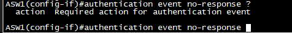

---

## 4. No-Response 재현 방법

Windows 유선 802.1X Supplicant 역할을 하는 `Wired AutoConfig` 서비스를 중지했다.

```cmd
net stop dot3svc
```

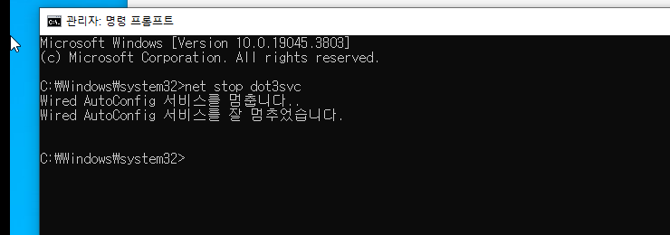

이 상태에서 기존 Authentication Session을 정리하고 새 인증을 유도하면:

```text
ASW1
  ↓ EAP Request Identity
Windows
  X Response 없음
  ↓
재전송
  ↓
EAP Timeout
```

이 발생한다.

ASW1 Debug에서 EAP Request 반복과 `EAP_TIMEOUT`, `AUTH_TIMEOUT`이 확인되었고, 이후 Local Guest/No-Response Policy가 선택되었다.

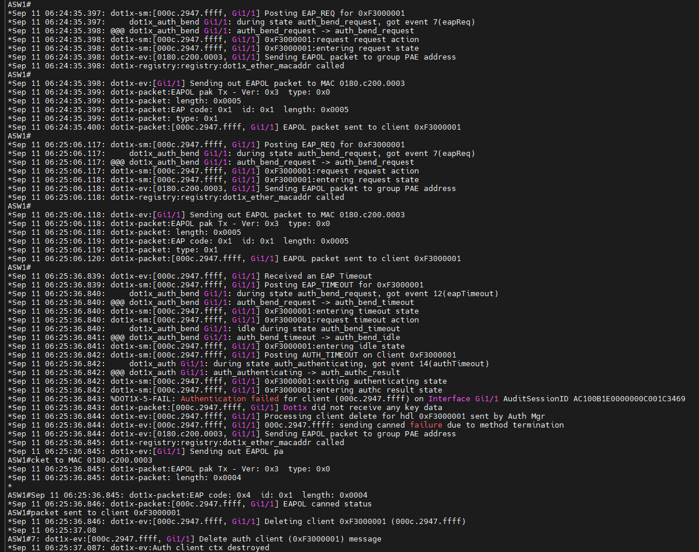

---

## 5. VLAN99 Runtime Placement

No-Response 처리 후 `show authentication sessions interface Gi1/1 details`와 `show vlan brief`에서 VLAN99 배치가 확인되었다.

핵심 상태:

```text
Status: Authorized

Local Policy:
  GUEST_VLAN_Gi1/1

Vlan Group:
  Vlan: 99
```

여기서 `Authorized`는 사용자 Credential Authentication 성공을 의미하지 않는다.

```text
Authentication
응답 없음 / 미완료

하지만

Switch Runtime Authorization
VLAN99 제한 접근 허용
```

이라는 의미다.

---

## 6. VLAN99 DHCP

Client는 VLAN99에서 정상적으로 다음 주소를 획득했다.

```text
IPv4 Address     172.16.99.11
Subnet Mask      255.255.255.0
Default Gateway  172.16.99.1
```

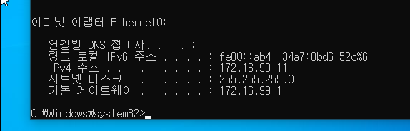

Backbone SVI:

```cisco
interface Vlan99
 ip address 172.16.99.1 255.255.255.0
 ip helper-address 172.16.10.10
```

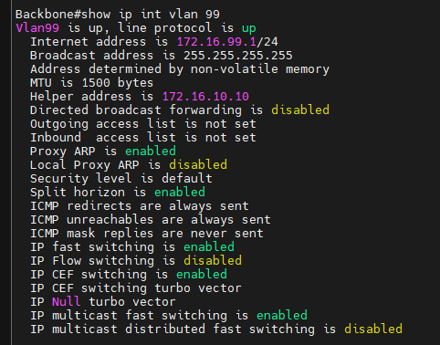

---

## 7. ACL 적용 전 Baseline

### 7.1 Own Gateway

```cmd
ping 172.16.99.1
```

성공.

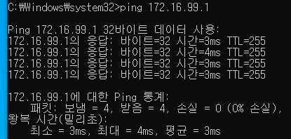

### 7.2 Corporate Internal

```cmd
ping 172.16.10.1
```

ACL 적용 전에는 성공.

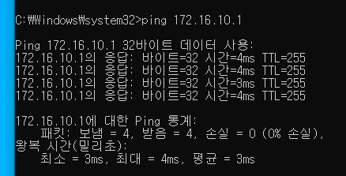

이 결과는 ACL 적용 후 Explicit Deny를 증명하기 위한 중요한 Before Evidence다.

### 7.3 Internet / DNS

`8.8.8.8`과 Public DNS Query는 실패했다.

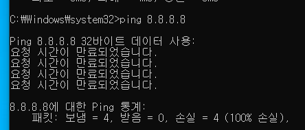

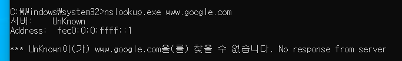

원인은 VLAN99가 Edge1의 NAT 대상에 포함되지 않았기 때문이다.

```text
ACL 적용 전 Internet 실패
≠ Security ACL에 의한 차단

실제 원인
= NAT_LIST에 172.16.99.0/24 없음
```

NAT omission은 보조 방어선으로 유지하지만, 보안 정책 자체는 VLAN99 Inbound ACL에서 명시적으로 Enforcement한다.

---

## 8. VLAN99 초기 Onboarding Security Policy

현재 Onboarding Portal, PKI Enrollment Server, Registration Server가 별도로 존재하지 않으므로 Version 1 정책은 최소 권한으로 설계한다.

| Seq | Source | Destination | Service | Action | 목적 |
|---:|---|---|---|---|---|
| 20 | DHCP Client | DHCP | UDP 68→67 | PERMIT | 주소 할당/갱신 |
| 40 | `172.16.99.0/24` | `172.16.99.1` | ICMP Echo | PERMIT | Gateway 진단 |
| 60 | `172.16.99.0/24` | `10.0.0.0/8` | IP Any | DENY | Private 보호 |
| 70 | `172.16.99.0/24` | `172.16.0.0/12` | IP Any | DENY | Corporate 보호 |
| 80 | `172.16.99.0/24` | `192.168.0.0/16` | IP Any | DENY | Private 보호 |
| 100 | `172.16.99.0/24` | Any | IP Any | DENY | Public Internet 차단 |
| 120 | Any | Any | IP Any | DENY | Catch-All |

현재 VLAN98과 Enforcement는 유사하지만 의미는 다르다.

```text
VLAN98
격리를 위한 최소 네트워크

VLAN99
향후 Onboarding Service를 추가하기 위한 최소 네트워크
```

---

## 9. ACL_ONBOARDING_IN

```cisco
ip access-list extended ACL_ONBOARDING_IN

 10 remark VLAN99 ONBOARDING RESTRICTED POLICY

 20 permit udp any eq bootpc any eq bootps

 40 permit icmp 172.16.99.0 0.0.0.255 host 172.16.99.1 echo

 60 deny ip 172.16.99.0 0.0.0.255 10.0.0.0 0.255.255.255

 70 deny ip 172.16.99.0 0.0.0.255 172.16.0.0 0.15.255.255

 80 deny ip 172.16.99.0 0.0.0.255 192.168.0.0 0.0.255.255

 100 deny ip 172.16.99.0 0.0.0.255 any

 120 deny ip any any
```

Backbone VLAN99에 Inbound로 적용했다.

```cisco
interface Vlan99
 ip access-group ACL_ONBOARDING_IN in
```

---

## 10. ACL 적용 후 DHCP Regression

ACL 적용 후:

```cmd
ipconfig /release
ipconfig /renew
```

를 수행했다.

결과:

```text
IPv4 Address     172.16.99.11
Subnet Mask      255.255.255.0
Default Gateway  172.16.99.1
```

정상.

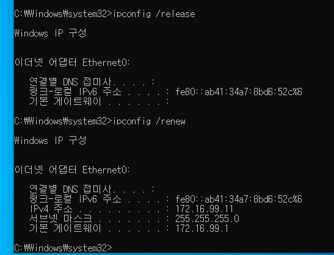

---

## 11. ACL 적용 후 Positive / Negative Test

### Gateway

`172.16.99.1` 성공.

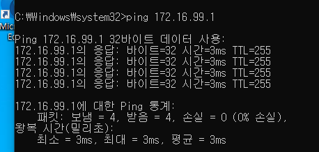

### Corporate

`172.16.10.1`은 ACL 적용 전 성공했지만 적용 후 차단.

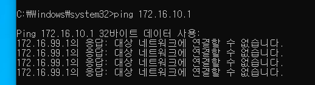

### Internet

`8.8.8.8` 차단.

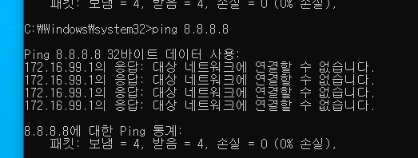

### DNS

`www.google.com` Query 실패.

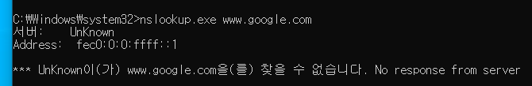

---

## 12. ACL Counter 검증

실제 Counter:

```text
20 permit udp any eq bootpc any eq bootps
   5 matches

40 permit icmp 172.16.99.0/24 host 172.16.99.1 echo
   8 matches

60 deny 10.0.0.0/8
   0 matches

70 deny 172.16.0.0/12
   16 matches

80 deny 192.168.0.0/16
   0 matches

100 deny any
   17 matches
```

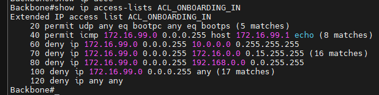

해석:

```text
DHCP Release/Renew        → Seq20 Match
Own Gateway               → Seq40 Match
Corporate 172.16.10.1     → Seq70 DENY Match
Internet / DNS            → Seq100 DENY Match
```

따라서 단순히 "Ping이 안 된다" 수준이 아니라 실제 Security Policy Hit Counter로 Enforcement를 증명했다.

---

## 13. Recovery Test — dot3svc 재시작

VLAN99는 영구 격리망이 아니라 정상 인증으로 복귀할 수 있는 Transitional Network여야 한다.

Windows:

```cmd
net start dot3svc
```

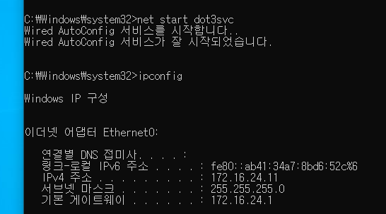

Supplicant가 다시 동작하면서 `A10014`의 정상 802.1X 인증이 재개되었다.

---

## 14. FreeRADIUS 재인증 Evidence

재인증 시작 시점에는 Client가 아직 VLAN99에 있으므로 Access-Request에는 이전 Runtime 정보가 포함될 수 있다.

```text
User-Name          A10014
Calling-Station-Id 00-0C-29-47-FF-FF
Framed-IP-Address  172.16.99.11
vlan-id            99
NAS-Port-Id        GigabitEthernet1/1
```

그 후 PEAP/MSCHAPv2 인증이 진행되고 RADIUS SQL Policy는 정상 Role을 조회한다.

```text
A10014
  ↓
radusergroup
  ↓
VLAN_24
  ↓
Tunnel-Type = VLAN
Tunnel-Medium-Type = IEEE-802
Tunnel-Private-Group-Id = 24
```

최종:

```text
Access-Accept
VLAN24
```

가 전송되었다.

---

## 15. VLAN24 정상 복귀

Client는 최종적으로:

```text
IPv4 Address     172.16.24.11
Default Gateway  172.16.24.1
```

을 사용한다.

ASW1 `show vlan brief`에서도 `Gi1/1`이 VLAN24에 배치되었다.

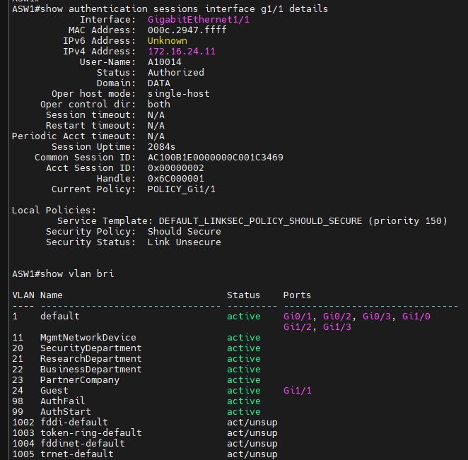

Accounting에서도 Runtime 상태가 다음으로 갱신되었다.

```text
User-Name          A10014
vlan-id            24
Framed-IP-Address  172.16.24.11
NAS-Port-Id        GigabitEthernet1/1
```

즉 다음 End-to-End Recovery가 실제로 성립했다.

```text
VLAN99
172.16.99.11
      ↓
dot3svc START
      ↓
802.1X PEAP/MSCHAPv2
      ↓
Access-Accept VLAN24
      ↓
Gi1/1 → VLAN24
      ↓
172.16.24.11
```

---

## 16. Fresh Session 검증 시 CLI 표시 특이사항

Recovery 이후 Fresh Authentication Session을 새로 생성해도 다음 Local Policy가 계속 표시되었다.

```text
Local Policies:

 Service Template:
 DEFAULT_LINKSEC_POLICY_SHOULD_SECURE

 Security Policy:
 Should Secure

 Security Status:
 Link Unsecure
```

이 출력만 보면 예전의:

```text
Server Policies:
 Vlan Group: Vlan 24

Method Status:
 dot1x Authc Success
```

와 달라 보여 혼동될 수 있다.

하지만 실제 기능 검증 결과는 모두 정상이다.

```text
FreeRADIUS Access-Accept VLAN24          ✅
ASW1 Gi1/1 VLAN24                        ✅
Client 172.16.24.11                      ✅
Gateway / Network Communication          ✅
RADIUS Accounting vlan-id=24             ✅
Accounting Framed-IP=172.16.24.11        ✅
Fresh Session ID 변경                    ✅
```

따라서 현재 Lab에서는 해당 CLI 표시를 **802.1X 실패로 판정하지 않는다.**

`DEFAULT_LINKSEC_POLICY_SHOULD_SECURE`와 `Link Unsecure`는 Link Security/MACsec 관련 Local Policy 표시이며, 현재 프로젝트에서는 MACsec을 구성하지 않았다.

### 중요

이 현상의 정확한 내부 원인을 실장 Catalyst에서 검증한 것은 아니다.

EVE-NG의 가상 IOSvL2 이미지에서 Auth Manager / LinkSec 상태를 표시하는 특성 또는 제한일 가능성이 있으나, **확정된 Root Cause로 기록하지 않는다.**

문서상의 분류:

```text
Observed CLI Display Characteristic
Possible IOSvL2 / Virtual Platform Limitation
Functional Impact: None observed
Action: No remediation required in current Phase
```

즉 현재는 해결을 위해 설정을 변경하지 않는다.

---

## 17. 성공 판단 시 Evidence 우선순위

가상 Lab에서 하나의 CLI 출력만으로 정상/비정상을 판단하지 않는다.

이번 Phase의 권장 검증 우선순위:

```text
1. RADIUS Access-Accept / Reject
2. RADIUS Tunnel VLAN Attribute
3. Switch 실제 VLAN Placement
4. Client 실제 IP / Gateway
5. RADIUS Accounting vlan-id / Framed-IP
6. 실제 Data Plane 통신
7. show authentication sessions의 세부 표시
```

`show authentication sessions`의 일부 Local Policy 표시가 어색하더라도 1~6이 일관되게 정상이라면 기능은 성공으로 판정한다.

---

## 18. Known Limitation 1 — VLAN98/99 DHCP Reservation

VLAN99도 VLAN98과 동일하게 Runtime Transitional VLAN이다.

현재 기존 DHCP 자동화가 최초 Lease를 Persistent Reservation으로 승격할 수 있으므로:

```text
VLAN99 DHCPACK
    ↓
AUTO_FIRST_LEASE
    ↓
dhcp_reservation
    ↓
pool_state = RESERVED
```

가 발생할 수 있다.

최종 설계:

```text
VLAN20/21/22/23/24/80
→ PERSISTENT

VLAN98/99
→ DYNAMIC_ONLY
```

현재 Phase에서는 Networking 검증을 위해 기존 로직을 변경하지 않는다.

---

## 19. Known Limitation 2 — Onboarding Service 미구현

현재 VLAN99는:

```text
DHCP        PERMIT
Gateway     PERMIT
Corporate   DENY
Internet    DENY
DNS         DENY
```

수준이다.

향후 실제 Onboarding Network로 확장할 경우 다음 서비스를 명시적으로 설계한다.

```text
Internal DNS
NTP
Onboarding Portal
PKI / Certificate Enrollment
Device Registration
Agent / Supplicant Deployment
```

필요한 Destination/Port만 ACL에 추가한다.

---

## 20. 향후 MAB 연계

실제 환경의 No-Response Endpoint에는 다음이 포함될 수 있다.

```text
Printer
IP Phone
IoT
산업 장비
802.1X 미지원 Appliance
```

따라서 최종 NAC 흐름은 다음 방향으로 확장하는 것이 적절하다.

```text
802.1X
  ├── Success → Normal Role
  ├── Reject  → VLAN98
  └── No Response
          ↓
         MAB
       ┌──┴──┐
       │     │
    Success  Fail
       │     │
       ▼     ▼
 Device    VLAN99
 Role      Onboarding
```

VLAN99를 "802.1X 미지원 장비의 최종 운영 VLAN"로 사용하지 않고, 미등록 단말의 Onboarding/Registration Zone으로 유지한다.

---

## 21. Troubleshooting Notes

### VLAN99에 들어가지 않을 때

```text
1. VLAN99 존재 여부
2. Trunk Allowed/Active/STP Forwarding
3. Backbone Vlan99 SVI
4. ip helper-address
5. dhcp_scope / dhcpd.conf
6. no-response Action
7. 기존 Authentication Session 잔존 여부
8. dot3svc가 실제로 중지되었는지
```

순서로 확인한다.

### VLAN99인데 APIPA가 나올 때

```text
Switch Runtime VLAN99 성공
≠ DHCP 성공
```

이므로 DHCP Scope/Relay를 별도 검증한다.

### VLAN99에서 Internet이 안 될 때

ACL 적용 전에도 NAT_LIST에 VLAN99가 없으면 Internet이 실패할 수 있다.

따라서:

```text
NAT Failure
ACL Explicit Deny
```

를 혼동하지 않는다.

---

## 22. 완료 조건

### No-Response Detection
- [x] `dot3svc` 중지
- [x] EAP Request 반복 확인
- [x] Client Response 없음
- [x] EAP Timeout / No-Response 확인
- [x] Local Guest Policy 적용
- [x] VLAN99 배치

### DHCP
- [x] `172.16.99.11/24`
- [x] Gateway `172.16.99.1`
- [x] ACL 적용 후 Release/Renew 정상

### ACL
- [x] DHCP Permit
- [x] Gateway Permit
- [x] Corporate Explicit Deny
- [x] Public Internet Explicit Deny
- [x] DNS 차단
- [x] Counter 검증

### Recovery
- [x] `dot3svc` 재시작
- [x] A10014 정상 EAP/PEAP 재시작
- [x] FreeRADIUS Access-Accept
- [x] RADIUS VLAN24 Authorization
- [x] `Gi1/1 → VLAN24`
- [x] Client `172.16.24.11`
- [x] Accounting `vlan-id=24`
- [x] Accounting `Framed-IP=172.16.24.11`

### CLI Observation
- [x] Fresh Session 생성
- [x] Session ID 변경 확인
- [x] `DEFAULT_LINKSEC_POLICY_SHOULD_SECURE / Link Unsecure` 계속 표시
- [x] 실제 기능 영향 없음 확인
- [x] 현재 Phase에서는 별도 수정하지 않기로 결정

---

## 23. 최종 상태

```text
                Normal Identity Plane

A10014
HR/RADIUS Role
VLAN24
        │
        │ Supplicant Off
        ▼

                Runtime NAC Plane

NO_RESPONSE
        ↓
VLAN99
172.16.99.11
        ↓
ACL_ONBOARDING_IN
        │
        ├── DHCP       PERMIT
        ├── Gateway    PERMIT
        ├── Corporate  DENY
        └── Internet   DENY

        │
        │ dot3svc START
        ▼

PEAP/MSCHAPv2
        ↓
Access-Accept
VLAN24
        ↓
172.16.24.11
```

Phase 3-4는 **802.1X Supplicant 무응답 Endpoint를 VLAN99 Onboarding Zone으로 제한한 뒤, Supplicant가 정상화되면 사용자 개입을 최소화하면서 정상 RADIUS Role VLAN으로 복귀할 수 있음을 검증한 단계**다.
